<!---->

# Keywords {.unnumbered}

## Terms {.unnumbered}

#### <u>A</u> {.unnumbered}

-   [aggregation](#aggreg)
-   [attributes](#attribute)
    -   [atomic](#atomic)
    -   [descriptive](#descriptive-attributes)

#### <u>B</u> {.unnumbered}

-   [buffer manager](#bufmanage)

#### <u>C</u> {.unnumbered}

-   [cardinality](#row-num)
-   [class hierarchies](#class-hrchy)
-   [constraints](#constraint)
    -   [covering](#covering-constraints)
    -   [domain](#domain-constraint)
    -   [integrity](#integrity-constraints)
    -   [key](#key-constraints)
    -   [overlap](#overlap-constraint)
    -   [participation](#part_constraints)

#### <u>D</u> {.unnumbered}

-   [database](#database)
-   [data model](#data-model)
-   [degree/arity](#col-num)
-   [diagrams](#diagrams)
    -   [class](#class-diagram)
    -   [activity](#activity-diagram)
    -   [statechart](#statechart-diagram)
-   [disk manager](#diskmanage)
-   [domain](#domain)
    -   [atomic](#atomic)

#### <u>E</u> {.unnumbered}

-   [entities](#entity)
    -   [weak entities](#wk-entity)
-   [E/R style translation](#erstyle)

#### <u>F</u> {.unnumbered}

-   [file](#file)
    -   [file layer](#filelayer)
    -   [heap file](#heapfile)
-   [frame (on a disk)](#frame)

<!-- #### <u>G</u> {.unnumbered} -->

<!-- #### <u>H</u> {.unnumbered} -->

#### <u>I</u> {.unnumbered}

-   [identifying owner](#id-owner)
-   [index](#index)
-   instance
    -   [relational database](#relational-db-instance)
    -   [relation](#relation-instance)

<!-- #### <u>J</u> {.unnumbered} -->

#### <u>K</u> {.unnumbered}

-   [keys](#key)

<!-- #### <u>L</u> {.unnumbered} -->

<!-- #### <u>M</u> {.unnumbered} -->

#### <u>N</u> {.unnumbered}

-   [null values](#null)

<!-- #### <u>O</u> {.unnumbered} -->

#### <u>P</u> {.unnumbered}

-   [pages (on a disk)](#page)

#### <u>Q</u> {.unnumbered}

-   [query](#query),

#### <u>R</u> {.unnumbered}

-   [records/tuples](#record)
-   [data entry (item)](#dataentry)
-   [record id](#rid)
-   [relation](#relation)
-   [relational databases](#relational-db)
-   [relationships](#relationships)
    -   [identifying](#id-relationship)
    -   [ternary](#ternary)

#### <u>S</u> {.unnumbered}

-   [schema](#schema)
    -   [*defining a database*](#dbschema)
    -   [relational database](#relational-db-schema)
-   [SQL notes](#sql)
    -   [general](#sqlnotes)
    -   [MySQL](#mysql)
-   [sub-classes](#subclass)
-   [subqueries](#subq)

#### <u>T</u> {.unnumbered}

-   [tables](#table)
-   [translation](#translation)
    -   [null usage](#nulls)
    -   [object oriented](#objorient)
-   [triggers](#triggers)

<!-- #### <u>U</u> {.unnumbered} -->

#### <u>V</u> {.unnumbered}

-   value \*see [records/tuples](#record)

<!-- #### <u>W</u> {.unnumbered} -->

<!-- #### <u>X</u> {.unnumbered} -->

<!-- #### <u>Y</u> {.unnumbered} -->

<!-- #### <u>Z</u> {.unnumbered} -->

## Code {.unnumbered}

-   [CHECK](#checks)
-   [EXISTS](#exists)
-   [GROUP BY](#grpby)
-   [HAVING](#having)
-   [INFORMATION_SCHEMA](#infoschema)

# Diagrams {#diagrams .unnumbered}

<u>[activity diagrams]{#activity-diagram}</u> show the flow of actions in a business process while <u>[statechart diagrams]{#statechart-diagram}</u> describe dynamic interactions between system objects and <u>[class diagrams]{#class-diagram}</u> are more general ER diagrams to model application entities and their logical relationships in addition to data entities and their relationships

Keys are to be underlined in an ER diagram.

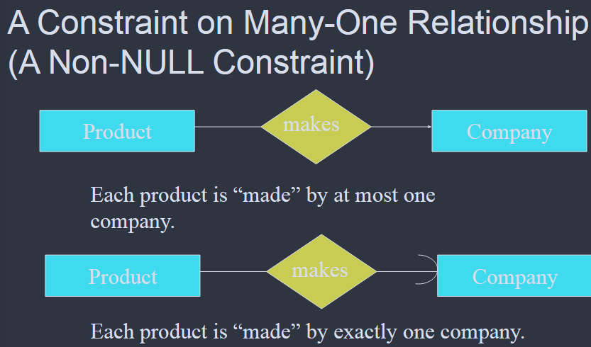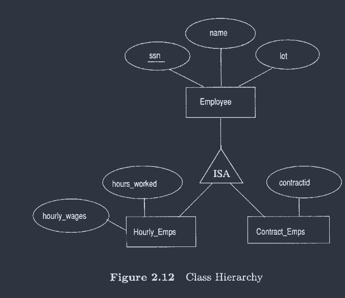](images/clipboard-851281759.png)

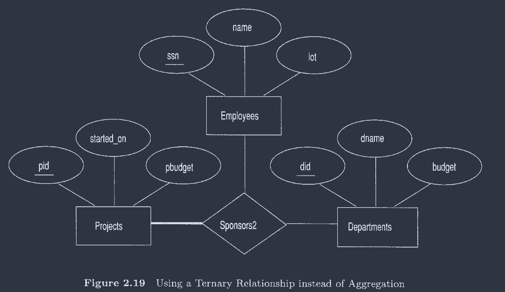](images/clipboard-2288075861.png)

# Database Systems Basics {.unnumbered}

## Definitions {.unnumbered}

### data models vs databases {.unnumbered}

<u>[data models]{#data-model}</u> model real-world scenarios of interest while <u>[databases]{#database}</u> are a collection of interrelated data items.

### entities and relationships {.unnumbered}

<u>[entities]{#entity}</u> are specific individually distinguishable things ex. students, faculty, courses, classrooms, etc... and a collection of entities is an <u>entity set</u>.

> An entity set should at least
>
> -   be more than the name of something, it needs at least one non-key attribute
>
> or
>
> -   be one of the "many" in a M:N or 1:N relationship

------------------------------------------------------------------------

<u>[relationships]{#relationships}</u> are the connections between [entities](#entity) and <u>relationship sets</u> are collections of relationships.

### schema, domains {.unnumbered}

<u>[schemas]{#schema}</u> are descriptions of data in terms of the [data model](#data-model)

------------------------------------------------------------------------

<u>[domains]{#domain}</u> are the allowable values for each [attribute](#attribute) essentially what type of field (`int`,`string`, etc...) each value can be. They must be [atomic](#atomic)

# Relational Model {.unnumbered}

### relational databases from the bottom up {.unnumbered}

<u>[tuples/records]{#record}</u> fill the rows of a <u>[relation]{#relation}</u> which is essentially a table. Technically the [table]{#table} is only specific <u>[instance]{#relation-instance}</u> of the [relation](#relation), but that is generally an arbitrary distinction

------------------------------------------------------------------------

the columns of the [relation](#relation) are <u>[attributes]{#attribute}</u> which are [entity](#entity) descriptions.

<ul>each attribute has an <u>[atomic domain]{#atomic}</u> (a string, an integer, ...) something that is a single non-breakable value, such as a persons ssn which cannot be broken up into smaller chunks of data</ul>

<u>atomic attributes</u> are attributes only made up of one atomic domain.

------------------------------------------------------------------------

the <u>[degree/arity]{#col-num}</u> is the number of [attributes](#attribute) or columns in the [relation](#relation) and the <u>[cardinality]{#row-num}</u> is the number of [tuples/records](#record) or rows in it

------------------------------------------------------------------------

<u>[relational databases]{#relational-db}</u> are specifically a collection of [relations](#relation) with distinct names

------------------------------------------------------------------------

<u>[relational database schema]{#relational-db-schema}</u> are a collection of [schemas](#schema) for the [relations](#relation) in the [database](#database)

------------------------------------------------------------------------

an <u>[instance]{#relational-db-instance}</u> of a [relational databases](#relational-db) is a collection of [relation instances](#relation-instance), one per [relation](#relation) [schema](#schema) in the general [database](#database) [schema](#schema)

### one step out {.unnumbered}

<u>[keys]{#key}</u> are an [attribute](#attribute) that can uniquely identify an object in the set - one of which will get designated as the <u>primary key</u> the identifying data point for that [record](#record), the others are <u>candidate keys</u> they could be primary keys but they aren't

------------------------------------------------------------------------

A [relationship](#relationship) can also have <u>[descriptive attributes]{#descriptive-attributes}</u> which describe the [relationship](#relationship) not the [entity](#entity).

<u>[ternary relationships]{#ternary}</u> are specifically when more than two [entities](#entity) are involved in a [relationship](#relationship).

------------------------------------------------------------------------

<u>[weak entities]{#wk-entity}</u> can only be identified uniquely by considering some of its [attributes](#attribute) in conjunction with the <u>[primary key](#key)</u> of another [entity](#entity).

[weak entities](#wk-entity) must have an <u>[identifying owner]{#id-owner}</u> whose <u>[primary key](#key)</u> connects the two.

This 1:N [relationship](#relationship) is the <u>[identifying relationship]{#id-relationship}</u>

------------------------------------------------------------------------

<u>[class hierarchies]{#class-hrchy}</u> are sometimes needed where <u>[sub-classes]{#subclass}</u> which are typically <u>[IS-A]{#isa}</u> [relationships](#relationship) have individual [attributes](#attribute) but also all of the superclass [attributes](#attribute)

<ul>such as some students are undergrad and others are graduate, they are both students, but they each have separate [attributes](#attributes) that allow for distinctions</ul>

------------------------------------------------------------------------

<u>[aggregation]{#aggreg}</u> is some form of combining data typically using <u>aggregate functions</u> *`sum`,`avg`,`count`, etc...*

### constraints {.unnumbered}

<u>[key constraints]{#key-constraints}</u> are restrictions on how [relationships](#relationship) can occur, ex. *each department can only have one manager*

these are also called <u>single value constraints</u> and are when an [attribute](#attribute)

------------------------------------------------------------------------

<u>[participation_constraints]{#part_constraints}</u> note the required participation level of an [entity](#entity), ex. *every department must have a manager, but every manager does not need to supervise an employee*

------------------------------------------------------------------------

<u>[integrity constraints]{#integrity-constraints}</u> are conditions providing specifying conditions that must be satisfied by the data

<ul>One type is <u>referential integrity constraints</u> ex. if you work for a company it has to exist in the database.</ul>

------------------------------------------------------------------------

<u>[domain constraints]{#domain-constraint}</u> specify what the [domains](#domain) are allowed to be for each [attributes](#attribute)

<ul>ex. people's ages have to be between 0 and 115</ul>

------------------------------------------------------------------------

<u>[overlap constraints]{#overlap-constraint}</u> determine if the subclass is allowed to contain the same [entity](#entity), ex. can one person be both a student and a teacher, if it is not specified no overlap is assumed.

------------------------------------------------------------------------

<u>[covering constraints]{#covering-constraints}</u> determine whether the [entities](#entity) in the subclass include ALL of the entities in the superclass, ex. must every employee either be hourly or contract, if not specified it is assumed that non subclass [entities](#entity) are allowed

------------------------------------------------------------------------

# Model to DB Translations {#translation .unnumbered}

3 styles

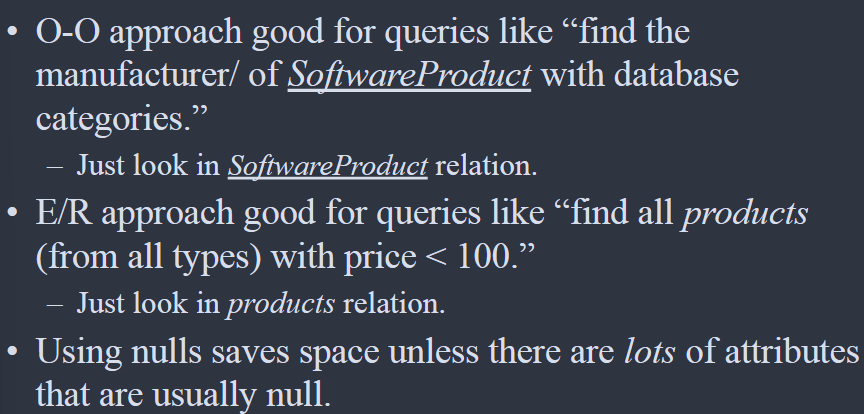](images/clipboard-1901644240.png)

## (OO) Object Oriented {#objorient .unnumbered}

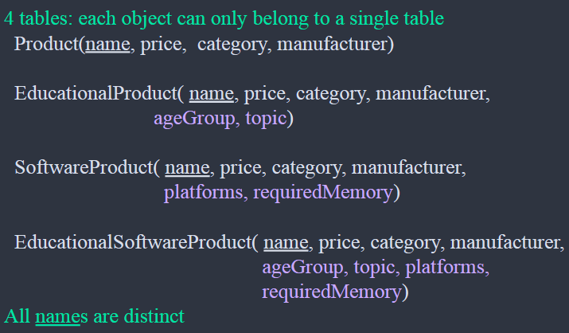](images/clipboard-1498651903.png){width="265"}

## E/R Style {#erstyle .unnumbered}

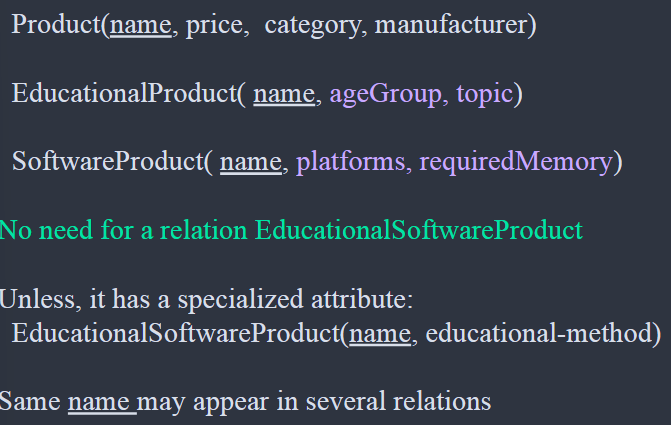](images/clipboard-3761296401.png){width="175"}

## Using Nulls {#nulls .unnumbered}

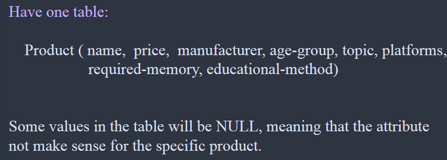](images/clipboard-4060100682.png){width="294"}

# DB Programming {.unnumbered}

### special values {.unnumbered}

the SQL logic is more accurately depicted as 3-part, `true`,`false`, and`unknown` since when any [value](#record) is compared to [NULL]{#null} the [value](#record) is unknown ala schrodingers cat. therefore accounting for nulls requires the usage of the null-specific terms

```         
IS null
IS NOT null
#etc...
```

------------------------------------------------------------------------

[EXISTS(`query`)]{#exists} is true if and **only** if there is a valid [query](#query) within.

### logic {.unnumbered}

<u>[queries]{{#query}</u> are essentially questions posed to the database that pull information out of the different tables

<u>[subqueries]{#subq}</u> or 2nd level `select... from... where...` statements can be used in place of [values](#record) including in `from` and `where` statements but they must be guaranteed to ONLY produce one [value](#record)

------------------------------------------------------------------------

[GROUP BY]{grpby} and [HAVING]{#having} are often used together to [aggregate](#aggreg) within [queries](#query) where `having` works pretty much like `is`

## defining a database schema {.unnumbered}

A <u>[database schema]{#dbschema}</u> contains the definitions for the [tables](#relation) of that database

<ul>other elements can also be in the database schema including [views](#views), [indexes](#index), and [triggers](#triggers)</ul>

## defining a relation {.unnumbered}

...

you can define the `default` values by adding `default 'value',` onto the line, this can be done when adding to a [table](#relation) as well

## editing {.unnumbered}

you can insert [values](#record) into [tables](#relation) via [subqueries](#subq)

`INSERT INTO ...      (SELECT...      FROM...      WHERE...) );`

------------------------------------------------------------------------

when deleting be wary around using `and` because it is a staged process and will not work properly

## constraints {.unnumbered}

<u>[constraints]{#constraint}</u> are relationships among data elements the the DMBS is required to enforce of which there are a few different kinds

<ul>[covering constraints](#covering-constraints), [domain constraints](#domain-constraint), [integrity constraints](#integrity-constraints), [key constraints](#key-constraints), [overlap constraints](#overlap-constraint), [participation constraints](#part_constraints)</ul>

<u>[triggers]{#triggers}</u> are executed only when a specific condition occurs.

<u>[checks]{#checks}</u> put constraints on the value of particular attributes but only checks when the value is inserted or updated

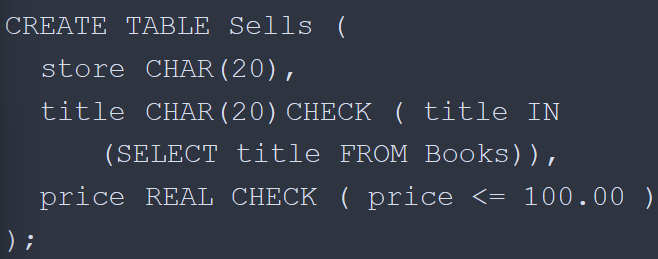](images/clipboard-1504354693.png)

<u>[assertions]{#assertions}</u> should be checked after every modification to any relation of the DB

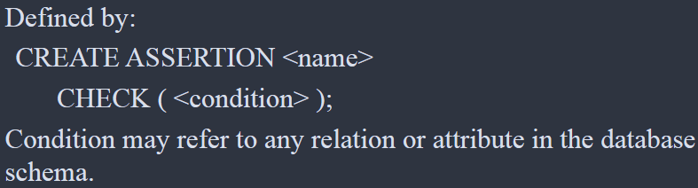](images/clipboard-2975703507.png)

##### foreign key constraint problems {.unnumbered}

with foreign keys care must be taken so that the insertion of a record into one table does not call for a non-existent record in the linked table and that in the reverse the deletion of a record from one table would not cause a broken link

# CS database info {.unnumbered}

## definitions {.unnumbered}

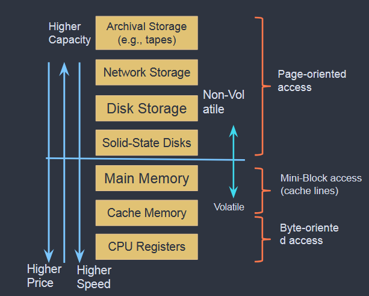

each [record](#record) in a file has a unique identifier called the <u>[record id]{#rid}</u> which is used to identify the disk address

data is read into memory for processing and written into storage by the <u>[buffer manager]{#bufmanage}</u> while the space on the disk is handled by the <u>[disk space manager]{#diskmanage}</u>

the <u>[file layer]{#filelayer}</u> stores the [records](#records) in a file of records <u>[(file)]{#file}</u> (which is essentially a [table](#relation)) in a collection of disk pages <u>[(pages)]{#page}</u> (essentially just data chunks). Also tracking pages alloted to files, and the space within.

a <u>[heap file]{#heapfile}</u> is unordered,

### operations

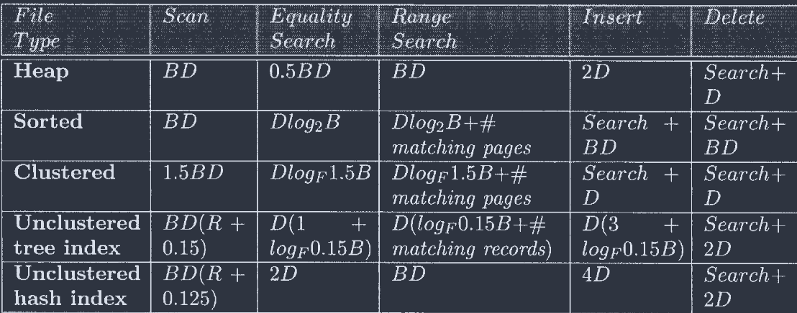

#### unsorted

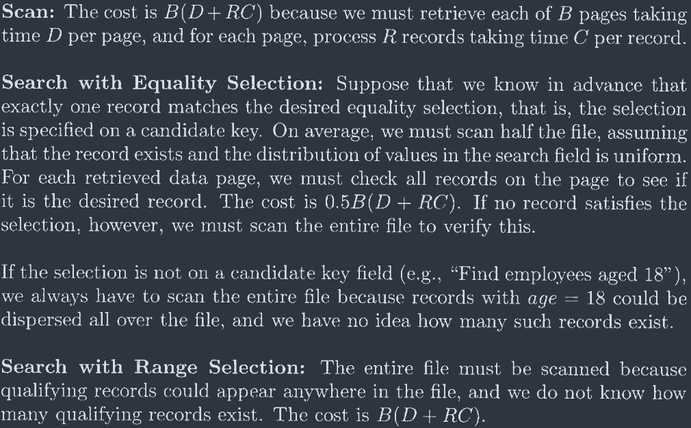](images/clipboard-429328729.png)

#### sorted

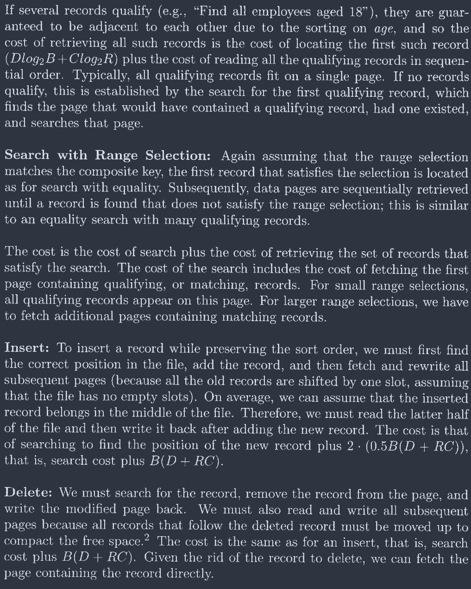](images/clipboard-4123099914.png)


#### clustered

](images/clipboard-732581811.png)


#### heap unclustered tree

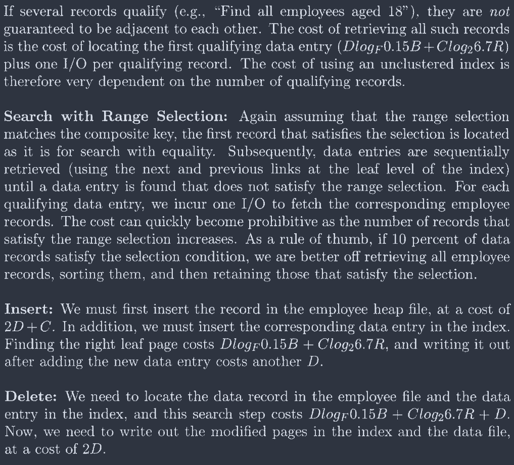](images/clipboard-96040907.png)

#### unclustered hash

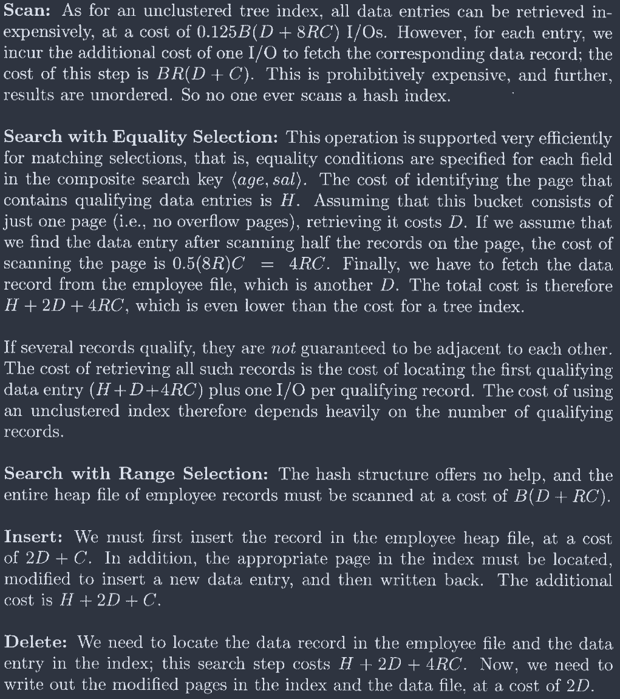](images/clipboard-1384868226.png)

## Buffer {.unnumbered}

## Indexing {.unnumbered}

an <u>[index]{#index}</u> organizes data records (or [data entries]{#dataentry} which can contain one or more records with that same search value) on disk

there are three main ways to index stored data entry

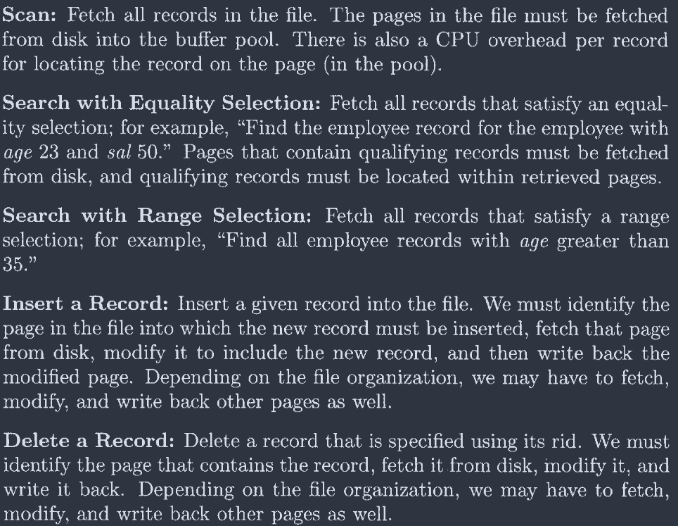](images/clipboard-3733344097.png)

### Hashing

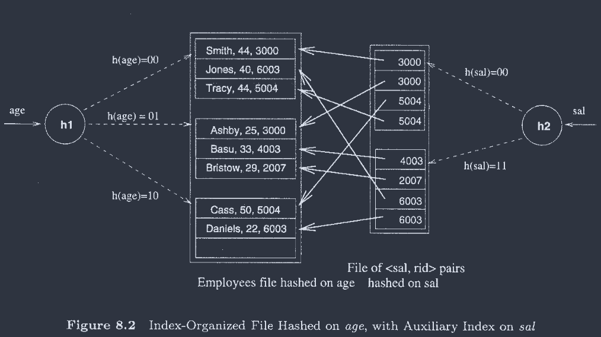

### Tree {-=""}

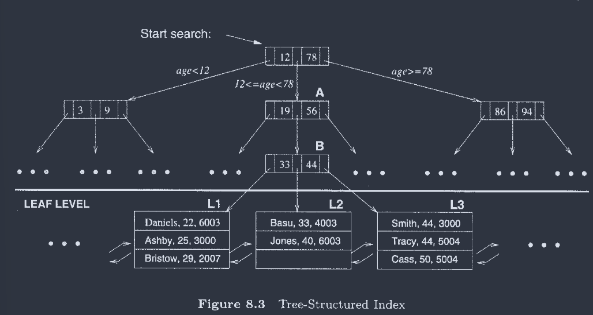

## Memory

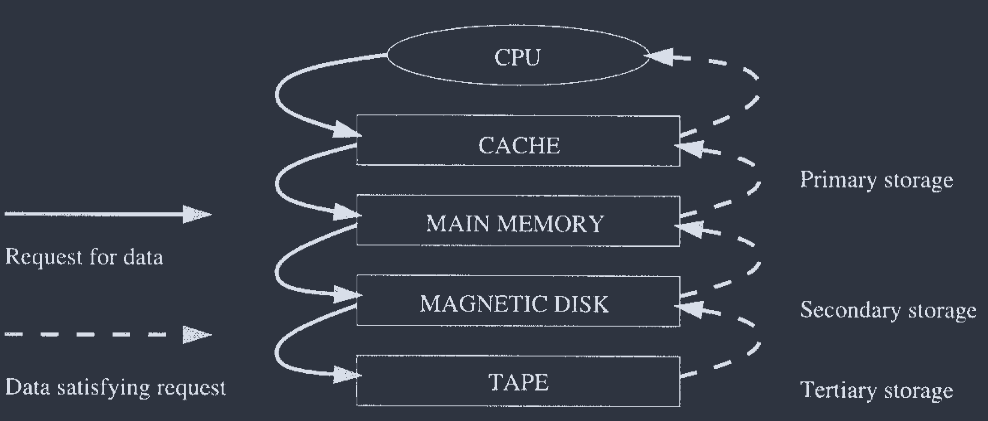

## Storage {.unnumbered}

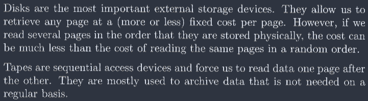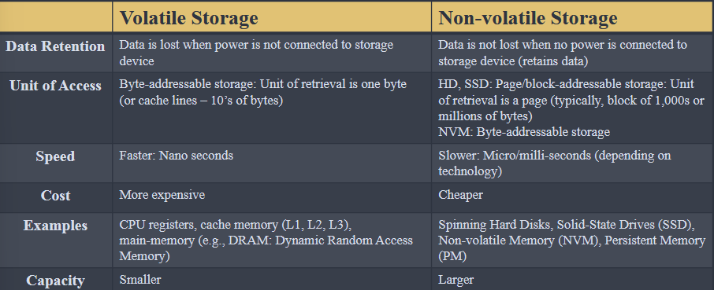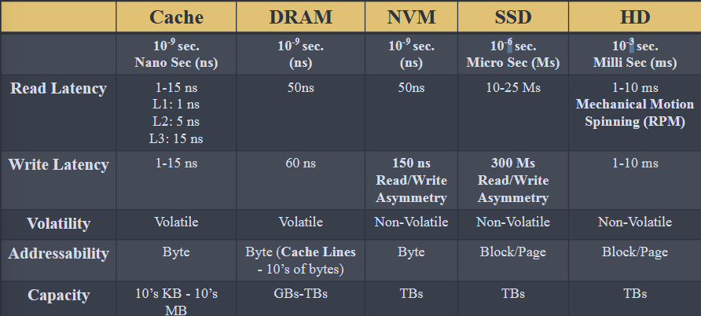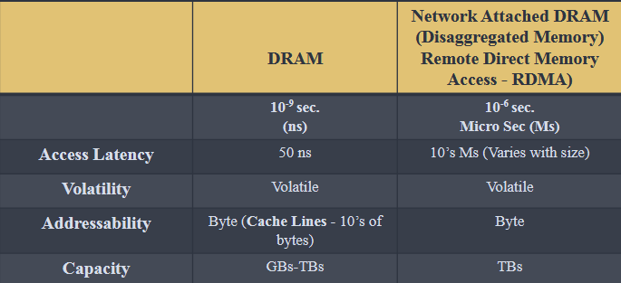

# `SQL` Notes {#sql .unnumbered}

## `INFORMATION_SCHEMA` {#infoschema .unnumbered}

selected tables out of the information schema db find all at

[MYSQL INFORMATION SCHEMA LINK](https://dev.mysql.com/doc/mysql-infoschema-excerpt/5.7/en/information-schema-general-table-reference.html)


$$COLUMNS$$

-   `TABLE_CATALOG`
    -   The name of the catalog to which the table containing the column belongs. This value is always `def`.
-   `TABLE_SCHEMA`
    -   The name of the schema (database) to which the table containing the column belongs.
-   `TABLE_NAME`
    -   The name of the table containing the column.
-   `COLUMN_NAME`
    -   The name of the column.
-   `ORDINAL_POSITION`
    -   The position of the column within the table. `ORDINAL_POSITION` is necessary because you might want to say `ORDER` BY `ORDINAL_POSITION.` Unlike `SHOW COLUMNS`, `SELECT` from the `COLUMNS` table does not have automatic ordering.
-   `COLUMN_DEFAULT`
    -   The default value for the column. This is `NULL` if the column has an explicit default of `NULL`, or if the column definition includes no `DEFAULT` clause.
-   `IS_NULLABLE`
    -   The column nullability. The value is `YES` if `NULL` values can be stored in the column, `NO` if not.
-   `DATA_TYPE`
    -   The column data type.
    -   The `DATA_TYPE` value is the type name only with no other information. The `COLUMN_TYPE` value contains the type name and possibly other information such as the precision or length.
-   `CHARACTER_MAXIMUM_LENGTH`
    -   For string columns, the maximum length in characters.
-   `CHARACTER_OCTET_LENGTH`
    -   For string columns, the maximum length in bytes.
-   `NUMERIC_PRECISION`
    -   For numeric columns, the numeric precision.
-   `NUMERIC_SCALE`
    -   For numeric columns, the numeric scale.
-   `DATETIME_PRECISION`
    -   For temporal columns, the fractional seconds precision.
-   `CHARACTER_SET_NAME`
    -   For character string columns, the character set name.
-   `COLLATION_NAME`
    -   For character string columns, the collation name.
-   `COLUMN_TYPE`
    -   The column data type.
    -   The `DATA_TYPE` value is the type name only with no other information. The `COLUMN_TYPE` value contains the type name and possibly other information such as the precision or length.
-   `COLUMN_KEY`
    -   Whether the column is indexed:
        -   If `COLUMN_KEY` is empty, the column either is not indexed or is indexed only as a secondary column in a multiple-column, nonunique index.
        -   If `COLUMN_KEY` is `PRI`, the column is a `PRIMARY KEY` or is one of the columns in a multiple-column `PRIMARY KEY`.
        -   If `COLUMN_KEY` is `UNI`, the column is the first column of a `UNIQUE` index. (A `UNIQUE` index permits multiple `NULL` values, but you can tell whether the column permits `NULL` by checking the `Null` column.)
        -   If `COLUMN_KEY` is `MUL`, the column is the first column of a nonunique index in which multiple occurrences of a given value are permitted within the column.
        -   If more than one of the `COLUMN_KEY` values applies to a given column of a table, `COLUMN_KEY` displays the one with the highest priority, in the order `PRI`, `UNI`, `MUL.`
        -   A `UNIQUE` index may be displayed as `PRI` if it cannot contain `NULL` values and there is no `PRIMARY KEY` in the table. A `UNIQUE` index may display as `MUL` if several columns form a composite `UNIQUE` index; although the combination of the columns is unique, each column can still hold multiple occurrences of a given value.
-   `EXTRA`
    -   Any additional information that is available about a given column. The value is nonempty in these cases:

$$KEY_-COLUMN_-USAGE$$

The `KEY_COLUMN_USAGE` table describes which key columns have constraints.

-   `CONSTRAINT_CATALOG`
    -   The name of the catalog to which the constraint belongs. This value is always `def`.
-   `CONSTRAINT_SCHEMA`
    -   The name of the schema (database) to which the constraint belongs.
-   `CONSTRAINT_NAME`
    -   The name of the constraint.
-   `TABLE_CATALOG`
    -   The name of the catalog to which the table containing the column belongs. This value is always `def`.
-   `TABLE_SCHEMA`
    -   The name of the schema (database) to which the table containing the column belongs.
-   `TABLE_NAME`
    -   The name of the table containing the column.
-   `COLUMN_NAME`
    -   The name of the column that has the constraint.
    -   If the constraint is a foreign key, then this is the column of the foreign key, not the column that the foreign key references.
-   `ORDINAL_POSITION`
    -   The column's position within the constraint, not the column's position within the table. Column positions are numbered beginning with 1.
-   `POSITION_IN_UNIQUE_CONSTRAINT`
    -   NULL for unique and primary-key constraints. For foreign-key constraints, this column is the ordinal position in key of the table that is being referenced.
-   `REFERENCED_TABLE_SCHEMA`
    -   The name of the schema (database) referenced by the constraint.
-   `REFERENCED_TABLE_NAME`
    -   The name of the table referenced by the constraint.
-   `REFERENCED_COLUMN_NAME`
    -   The name of the column referenced by the constraint.

$$REFERENTIAL_-INFORMATION$$

The `REFERENTIAL_CONSTRAINTS` table provides information about foreign keys.

-   `CONSTRAINT_CATALOG`
    -   The name of the catalog to which the constraint belongs. This value is always `def`.
-   `CONSTRAINT_SCHEMA`
    -   The name of the schema (database) to which the constraint belongs.
-   `CONSTRAINT_NAME`
    -   The name of the constraint.
-   `UNIQUE_CONSTRAINT_CATALOG`
    -   The name of the catalog containing the unique constraint that the constraint references. This value is always `def`.
-   `UNIQUE_CONSTRAINT_SCHEMA`
    -   The name of the unique constraint that the constraint references.
-   `UNIQUE_CONSTRAINT_NAME`
    -   The name of the column that has the constraint.
-   `MATCH_OPTION`
    -   The value of the constraint `MATCH` attribute. The only valid value at this time is `NONE.`\
-   `UPDATE_RULE`
    -   The value of the constraint `ON UPDATE` attribute. The possible values are `CASCADE`, `SET NULL`, `SET DEFAULT`, `RESTRICT`, `NO ACTION`.
-   `DELETE_RULE`
    -   The value of the constraint `ON DELETE` attribute. The possible values are `CASCADE`, `SET NULL`, `SET DEFAULT`, `RESTRICT`, `NO ACTION`.
-   `TABLE_NAME`
    -   The name of the table containing the column.
-   `REFERENCED_TABLE_NAME`
    -   The name of the table referenced by the constraint.

$$TABLES$$

-   `TABLE_CATALOG`
    -   The name of the catalog to which the table containing the column belongs. This value is always `def`.
-   `TABLE_SCHEMA`
    -   The name of the schema (database) to which the table belongs.
-   `TABLE_NAME`
    -   The name of the table.
-   `TABLE_TYPE`
    -   `BASE TABLE` for a table, `VIEW` for a view, or `SYSTEM VIEW` for an `INFORMATION_SCHEMA` table.
    -   The `TABLES` table does not list `TEMPORARY` tables.
-   `ENGINE`
    -   The storage engine for the table.
    -   For partitioned tables, `ENGINE` shows the name of the storage engine used by all partitions.
-   `VERSION`
    -   The version number of the table's *.frm* file.
-   `ROW_FORMAT`
    -   The row-storage format (`Fixed`, `Dynamic`, `Compressed`, `Redundant`, `Compact`).
-   `TABLE_ROWS`
    -   The number of rows.
    -   `TABLE_ROWS` is `NULL` for `INFORMATION_SCHEMA` tables.
-   `AVG_ROW_LENGTH`
    -   The average row length.
-   `DATA_LENGTHH`
    -   ?
-   `MAX_DATA_LENGTH`
    -   ?
-   `INDEX_LENGTH`
    -   ?
-   `DATA_FREE`
    -   The number of allocated but unused bytes.
-   `AUTO_INCREMENT`
    -   The next `AUTO_INCREMENT` value.
-   `CREATE_TIME`
    -   when the table was created.
-   `UPDATE_TIME`
    -   When the data file was last updated.
-   `CHECK_TIME`
    -   When the table was last checked.
-   `TABLE_COLLATION`
    -   The table default collation. The output does not explicitly list the table default character set, but the collation name begins with the character set name.
-   `CHECKSUM`
    -   The live `checksum` value, if any.\
-   `CREATE_OPTIONS`
    -   Extra options used with CREATE TABLE
-   `TABLE_COMMENT`
    -   The comment used when creating the table (or information as to why MySQL could not access the table information).

$$TABLES_-CONSTRAINTS$$

The `TABLE_CONSTRAINTS` table describes which tables have constraints.

-   `CONSTRAINT_CATALOG`
    -   The name of the catalog to which the constraint belongs. This value is always `def`.
-   `CONSTRAINT_SCHEMA`
    -   The name of the schema (database) to which the constraint belongs.
-   `CONSTRAINT_NAME`
    -   The name of the constraint.
-   `MATCH_OPTION`
    -   The value of the constraint `MATCH` attribute. The only valid value at this time is `NONE.`\
-   `TABLE_SCHEMA`
    -   The name of the schema (database) to which the table belongs.
-   `TABLE_NAME`
    -   The name of the table.
-   `CONSTRAINT_TYPE`
    -   The type of constraint. The value can be `UNIQUE`, `PRIMARY KEY`, `FOREIGN KEY`, or `CHECK.` This is a `CHAR` (not `ENUM`) column. The `CHECK` value is not available until MySQL supports `CHECK.`
    -   The `UNIQUE` and `PRIMARY KEY` information is about the same as what you get from the `Key_name` column in the output from `SHOW INDEX` when the `Non_unique` column is 0.

## General SQL {#sqlnotes .unnumbered}

(pronounced sequel), (ANSI/ISO language)

Composed of descriptive words, and non procedural (you describe what you want done, not how

Categories of statements

{width="281"}

There is both ANSI SQL which is the standard and DMBS Specific 'dialects'

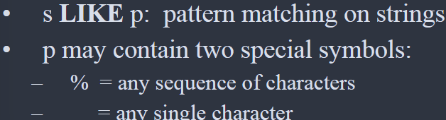{width="238"}](images/clipboard-1961114955.png)

constraints are optional and [] are not actually used

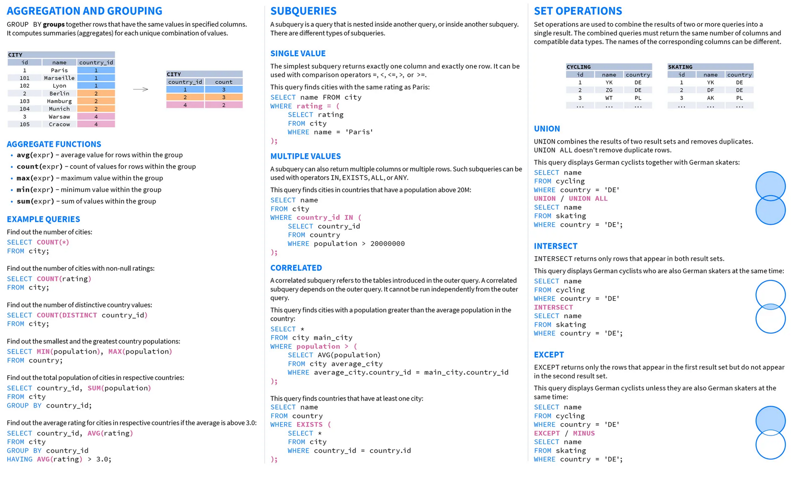  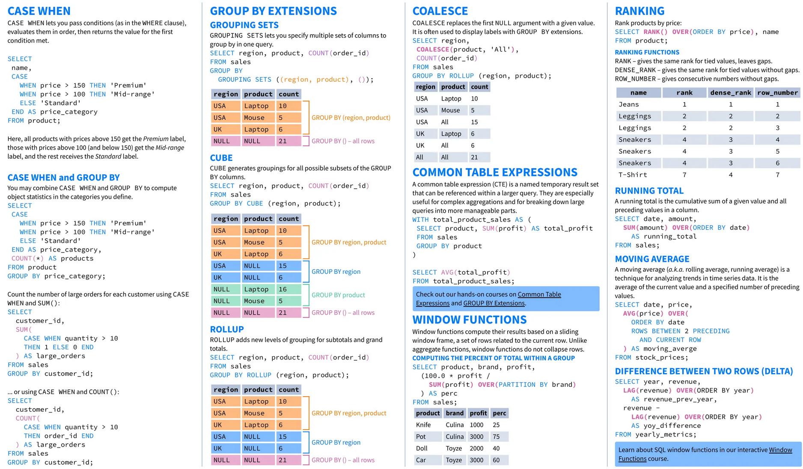 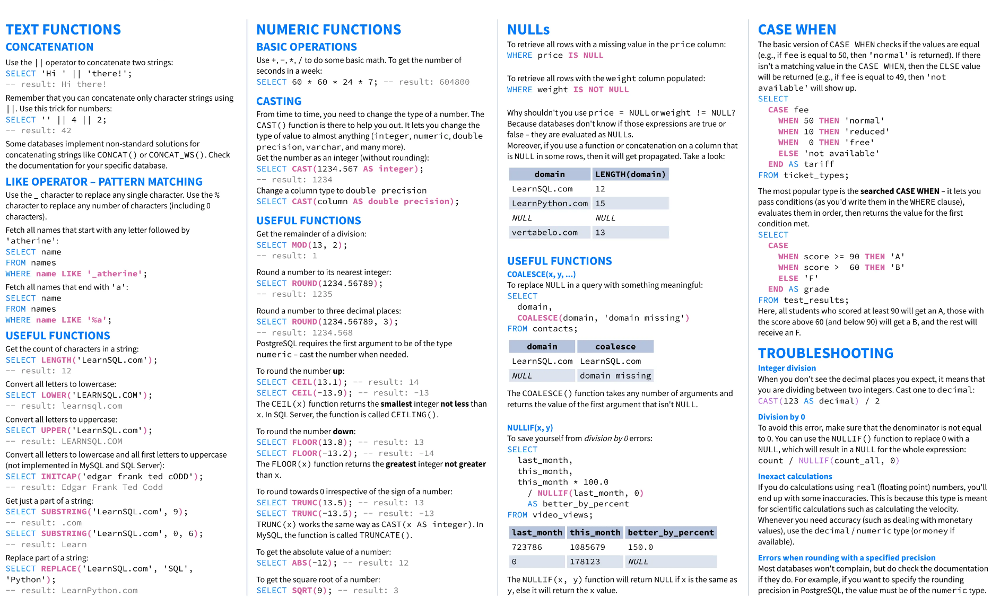 

## MySQL Specific {#mysql .unnumbered}

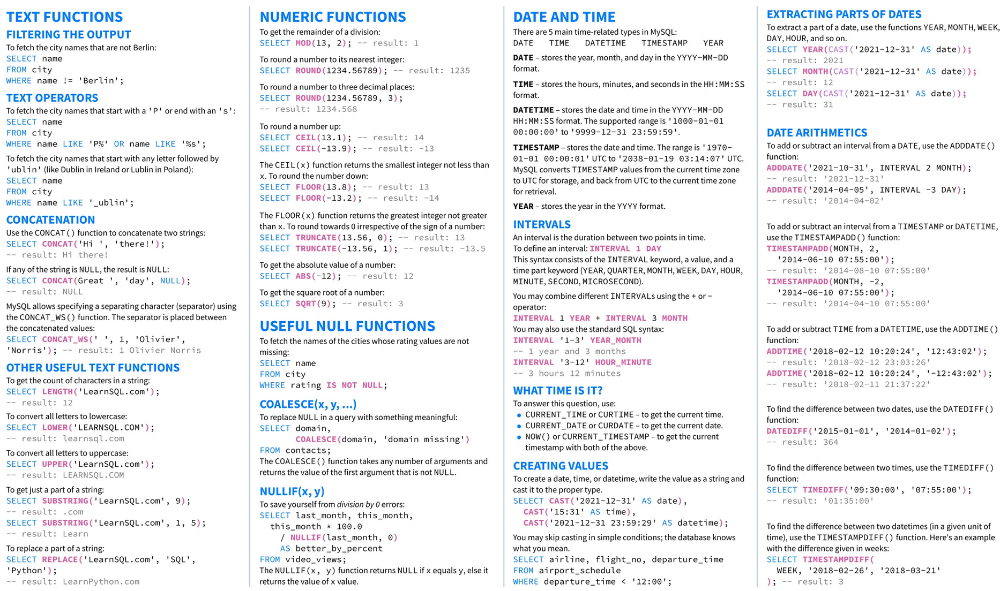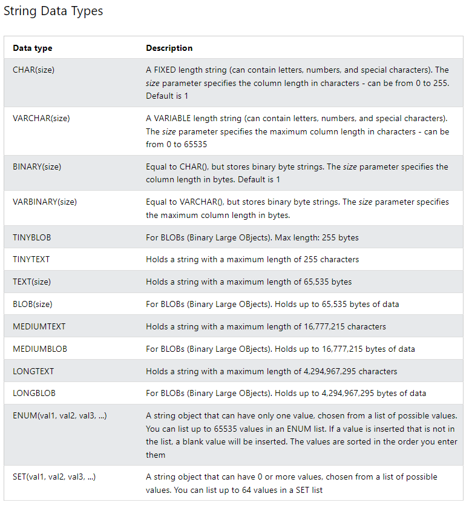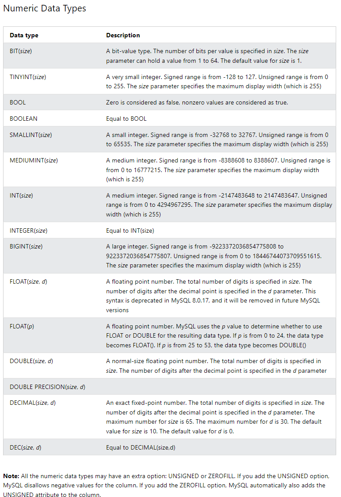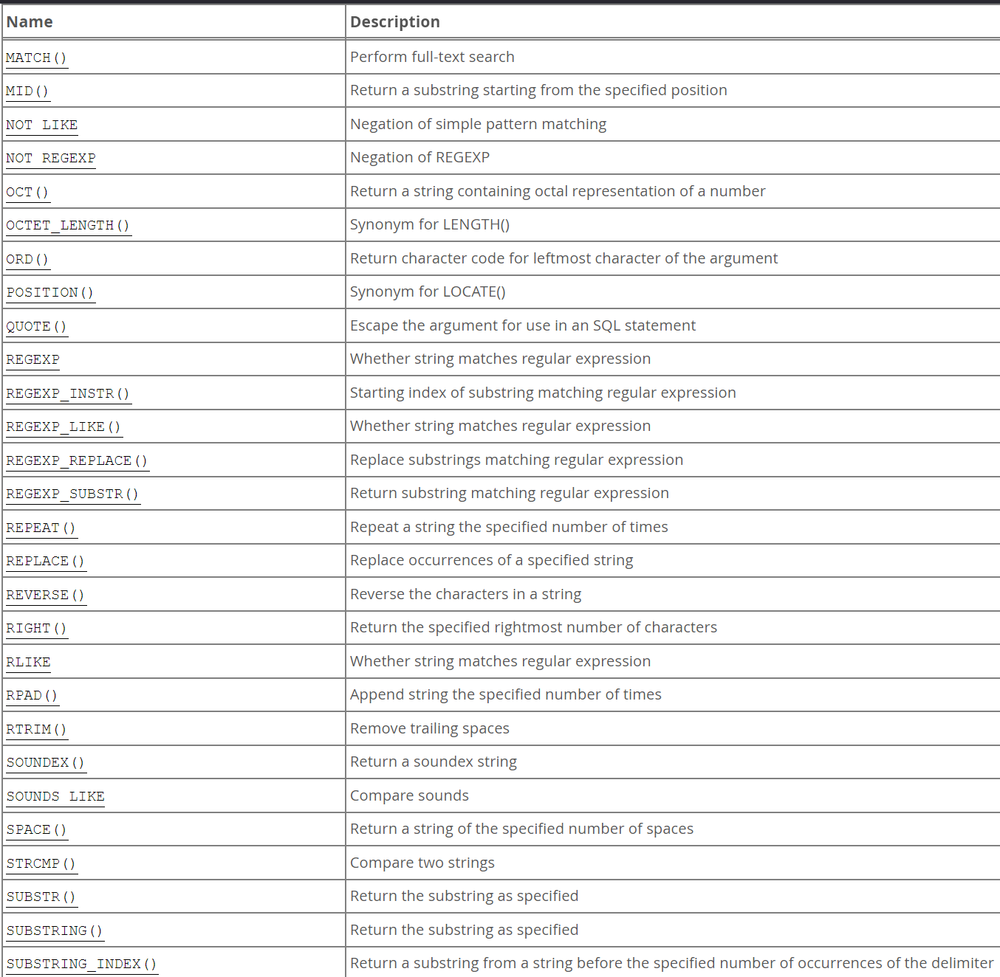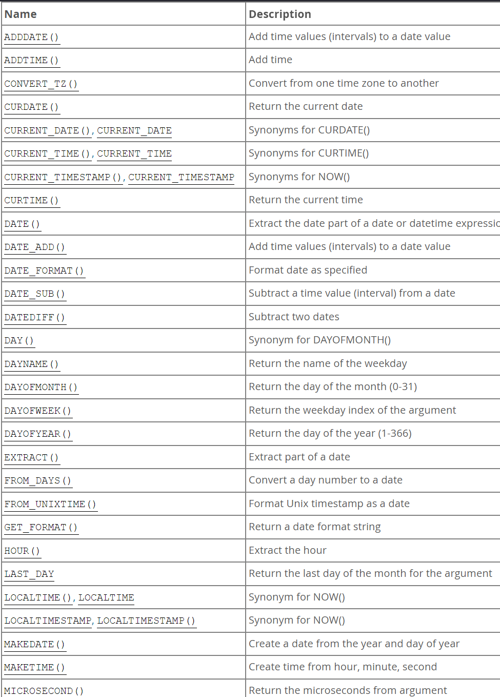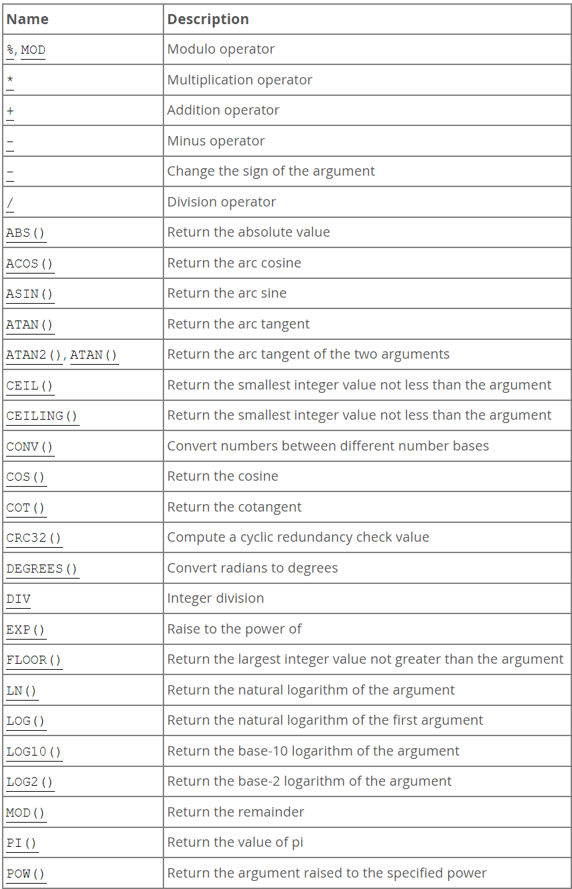

# `C++` Notes {#c++ .unnumbered}

# Database design broad scheme {.unnumbered}

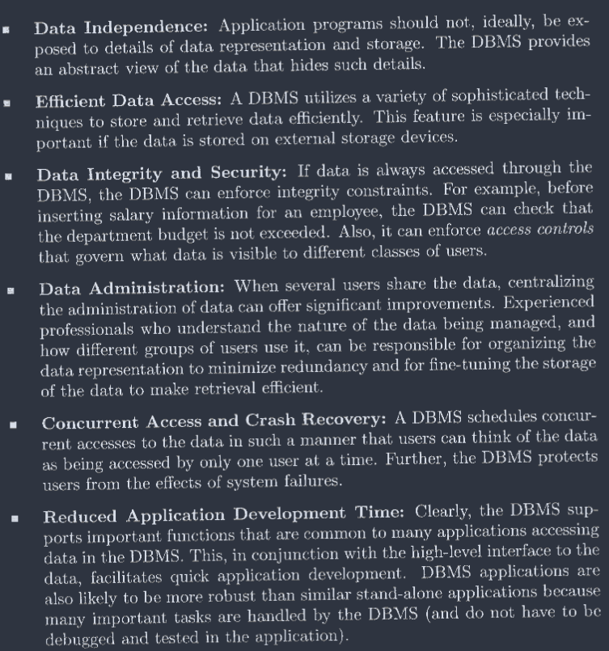](images/clipboard-3107985707.png)

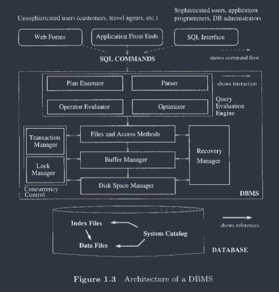](images/clipboard-2600053242.png)

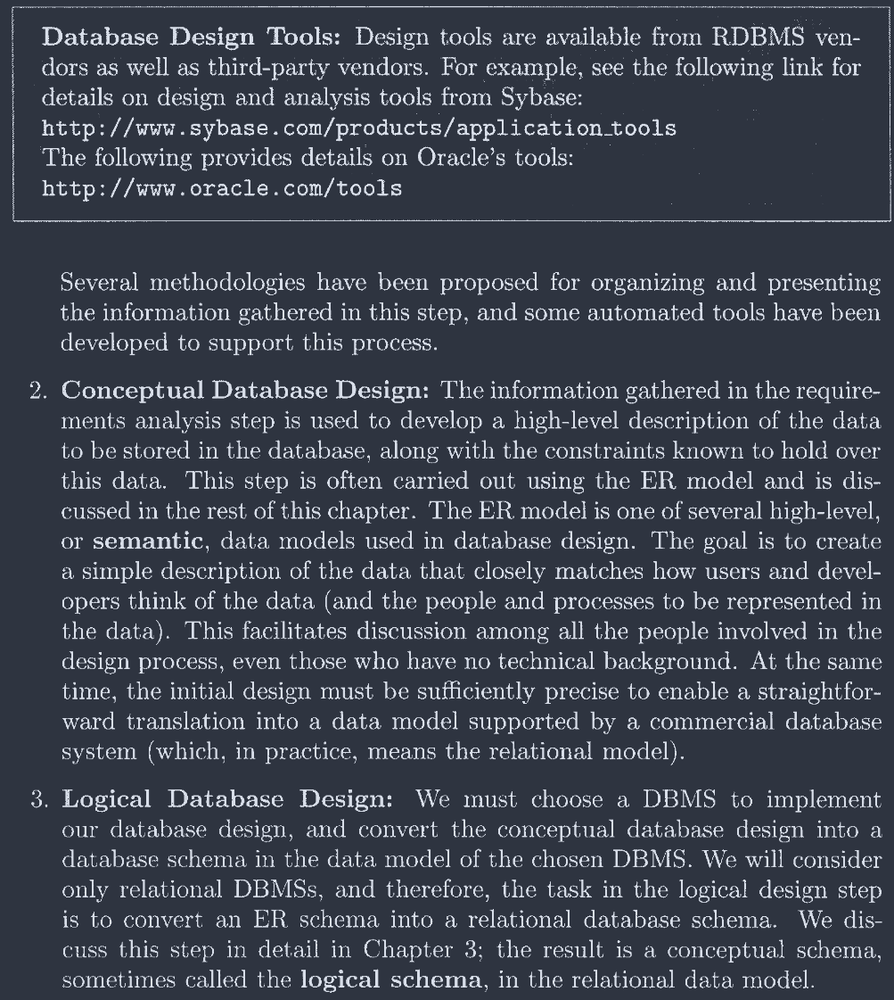](images/clipboard-3003974467.png)

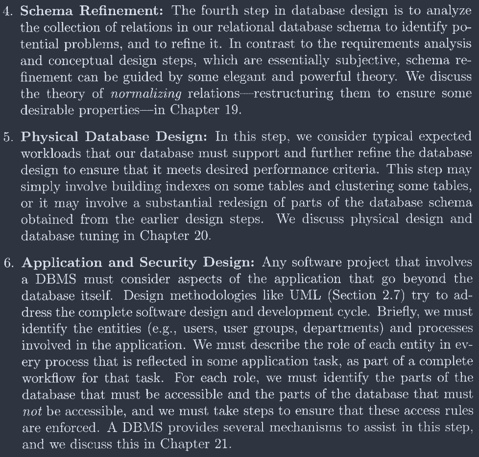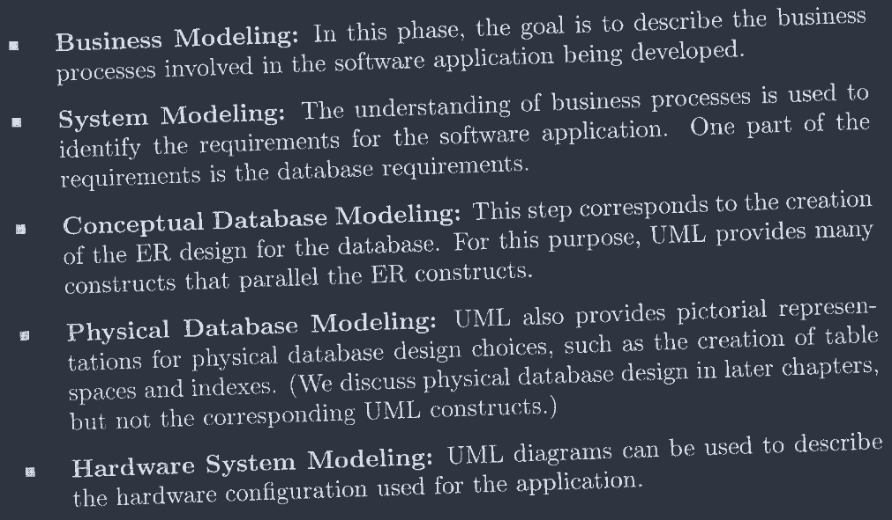
