<!---->

# SQL Database Design Notes {.tabset}

## ***General Notes*** {.tabset}

### INFORMATION SCHEMA {.tabset}

selected tables out of the information schema db find all at

[MYSQL INFORMATION SCHEMA](https://dev.mysql.com/doc/mysql-infoschema-excerpt/5.7/en/information-schema-general-table-reference.html)

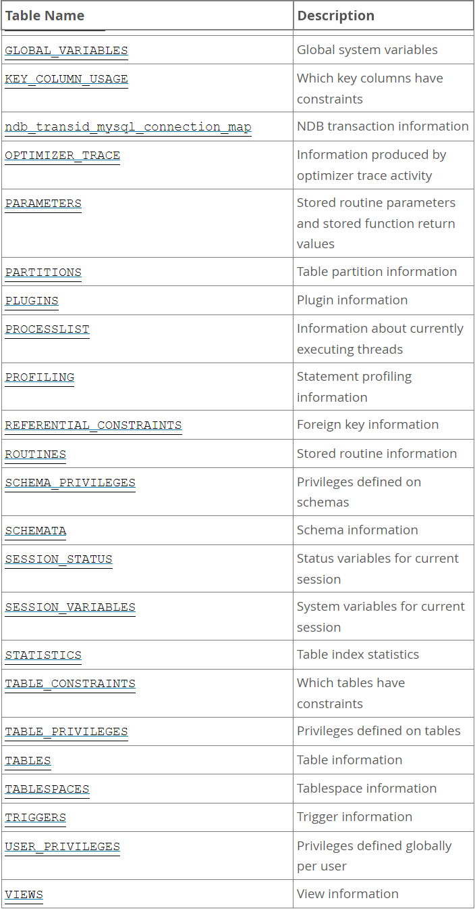

##### COLUMNS

-   `TABLE_CATALOG`
    -   The name of the catalog to which the table containing the column belongs. This value is always `def`.
-   `TABLE_SCHEMA`
    -   The name of the schema (database) to which the table containing the column belongs.
-   `TABLE_NAME`
    -   The name of the table containing the column.
-   `COLUMN_NAME`
    -   The name of the column.
-   `ORDINAL_POSITION`
    -   The position of the column within the table. `ORDINAL_POSITION` is necessary because you might want to say `ORDER` BY `ORDINAL_POSITION.` Unlike `SHOW COLUMNS`, `SELECT` from the `COLUMNS` table does not have automatic ordering.
-   `COLUMN_DEFAULT`
    -   The default value for the column. This is `NULL` if the column has an explicit default of `NULL`, or if the column definition includes no `DEFAULT` clause.
-   `IS_NULLABLE`
    -   The column nullability. The value is `YES` if `NULL` values can be stored in the column, `NO` if not.
-   `DATA_TYPE`
    -   The column data type.
    -   The `DATA_TYPE` value is the type name only with no other information. The `COLUMN_TYPE` value contains the type name and possibly other information such as the precision or length.
-   `CHARACTER_MAXIMUM_LENGTH`
    -   For string columns, the maximum length in characters.
-   `CHARACTER_OCTET_LENGTH`
    -   For string columns, the maximum length in bytes.
-   `NUMERIC_PRECISION`
    -   For numeric columns, the numeric precision.
-   `NUMERIC_SCALE`
    -   For numeric columns, the numeric scale.
-   `DATETIME_PRECISION`
    -   For temporal columns, the fractional seconds precision.
-   `CHARACTER_SET_NAME`
    -   For character string columns, the character set name.
-   `COLLATION_NAME`
    -   For character string columns, the collation name.
-   `COLUMN_TYPE`
    -   The column data type.
    -   The `DATA_TYPE` value is the type name only with no other information. The `COLUMN_TYPE` value contains the type name and possibly other information such as the precision or length.
-   `COLUMN_KEY`
    -   Whether the column is indexed:
        -   If `COLUMN_KEY` is empty, the column either is not indexed or is indexed only as a secondary column in a multiple-column, nonunique index.
        -   If `COLUMN_KEY` is `PRI`, the column is a `PRIMARY KEY` or is one of the columns in a multiple-column `PRIMARY KEY`.
        -   If `COLUMN_KEY` is `UNI`, the column is the first column of a `UNIQUE` index. (A `UNIQUE` index permits multiple `NULL` values, but you can tell whether the column permits `NULL` by checking the `Null` column.)
        -   If `COLUMN_KEY` is `MUL`, the column is the first column of a nonunique index in which multiple occurrences of a given value are permitted within the column.
        -   If more than one of the `COLUMN_KEY` values applies to a given column of a table, `COLUMN_KEY` displays the one with the highest priority, in the order `PRI`, `UNI`, `MUL.`
        -   A `UNIQUE` index may be displayed as `PRI` if it cannot contain `NULL` values and there is no `PRIMARY KEY` in the table. A `UNIQUE` index may display as `MUL` if several columns form a composite `UNIQUE` index; although the combination of the columns is unique, each column can still hold multiple occurrences of a given value.
-   `EXTRA`
    -   Any additional information that is available about a given column. The value is nonempty in these cases:

##### KEY_COLUMN_USAGE

The `KEY_COLUMN_USAGE` table describes which key columns have constraints.

-   `CONSTRAINT_CATALOG`
    -   The name of the catalog to which the constraint belongs. This value is always `def`.
-   `CONSTRAINT_SCHEMA`
    -   The name of the schema (database) to which the constraint belongs.
-   `CONSTRAINT_NAME`
    -   The name of the constraint.
-   `TABLE_CATALOG`
    -   The name of the catalog to which the table containing the column belongs. This value is always `def`.
-   `TABLE_SCHEMA`
    -   The name of the schema (database) to which the table containing the column belongs.
-   `TABLE_NAME`
    -   The name of the table containing the column.
-   `COLUMN_NAME`
    -   The name of the column that has the constraint.
    -   If the constraint is a foreign key, then this is the column of the foreign key, not the column that the foreign key references.
-   `ORDINAL_POSITION`
    -   The column's position within the constraint, not the column's position within the table. Column positions are numbered beginning with 1.
-   `POSITION_IN_UNIQUE_CONSTRAINT`
    -   NULL for unique and primary-key constraints. For foreign-key constraints, this column is the ordinal position in key of the table that is being referenced.
-   `REFERENCED_TABLE_SCHEMA`
    -   The name of the schema (database) referenced by the constraint.
-   `REFERENCED_TABLE_NAME`
    -   The name of the table referenced by the constraint.
-   `REFERENCED_COLUMN_NAME`
    -   The name of the column referenced by the constraint.

##### REFERENTIAL_INFORMATION

The `REFERENTIAL_CONSTRAINTS` table provides information about foreign keys.

-   `CONSTRAINT_CATALOG`
    -   The name of the catalog to which the constraint belongs. This value is always `def`.
-   `CONSTRAINT_SCHEMA`
    -   The name of the schema (database) to which the constraint belongs.
-   `CONSTRAINT_NAME`
    -   The name of the constraint.
-   `UNIQUE_CONSTRAINT_CATALOG`
    -   The name of the catalog containing the unique constraint that the constraint references. This value is always `def`.
-   `UNIQUE_CONSTRAINT_SCHEMA`
    -   The name of the unique constraint that the constraint references.
-   `UNIQUE_CONSTRAINT_NAME`
    -   The name of the column that has the constraint.
-   `MATCH_OPTION`
    -   The value of the constraint `MATCH` attribute. The only valid value at this time is `NONE.`\
-   `UPDATE_RULE`
    -   The value of the constraint `ON UPDATE` attribute. The possible values are `CASCADE`, `SET NULL`, `SET DEFAULT`, `RESTRICT`, `NO ACTION`.
-   `DELETE_RULE`
    -   The value of the constraint `ON DELETE` attribute. The possible values are `CASCADE`, `SET NULL`, `SET DEFAULT`, `RESTRICT`, `NO ACTION`.
-   `TABLE_NAME`
    -   The name of the table containing the column.
-   `REFERENCED_TABLE_NAME`
    -   The name of the table referenced by the constraint.

##### TABLES

-   `TABLE_CATALOG`
    -   The name of the catalog to which the table containing the column belongs. This value is always `def`.
-   `TABLE_SCHEMA`
    -   The name of the schema (database) to which the table belongs.
-   `TABLE_NAME`
    -   The name of the table.
-   `TABLE_TYPE`
    -   `BASE TABLE` for a table, `VIEW` for a view, or `SYSTEM VIEW` for an `INFORMATION_SCHEMA` table.
    -   The `TABLES` table does not list `TEMPORARY` tables.
-   `ENGINE`
    -   The storage engine for the table.
    -   For partitioned tables, `ENGINE` shows the name of the storage engine used by all partitions.
-   `VERSION`
    -   The version number of the table's *.frm* file.
-   `ROW_FORMAT`
    -   The row-storage format (`Fixed`, `Dynamic`, `Compressed`, `Redundant`, `Compact`).
-   `TABLE_ROWS`
    -   The number of rows.
    -   `TABLE_ROWS` is `NULL` for `INFORMATION_SCHEMA` tables.
-   `AVG_ROW_LENGTH`
    -   The average row length.
-   `DATA_LENGTHH`
    -   ?
-   `MAX_DATA_LENGTH`
    -   ?
-   `INDEX_LENGTH`
    -   ?
-   `DATA_FREE`
    -   The number of allocated but unused bytes.
-   `AUTO_INCREMENT`
    -   The next `AUTO_INCREMENT` value.
-   `CREATE_TIME`
    -   when the table was created.
-   `UPDATE_TIME`
    -   When the data file was last updated.
-   `CHECK_TIME`
    -   When the table was last checked.
-   `TABLE_COLLATION`
    -   The table default collation. The output does not explicitly list the table default character set, but the collation name begins with the character set name.
-   `CHECKSUM`
    -   The live `checksum` value, if any.\
-   `CREATE_OPTIONS`
    -   Extra options used with CREATE TABLE
-   `TABLE_COMMENT`
    -   The comment used when creating the table (or information as to why MySQL could not access the table information).

##### TABLES_CONSTRAINTS

The `TABLE_CONSTRAINTS` table describes which tables have constraints.

-   `CONSTRAINT_CATALOG`
    -   The name of the catalog to which the constraint belongs. This value is always `def`.
-   `CONSTRAINT_SCHEMA`
    -   The name of the schema (database) to which the constraint belongs.
-   `CONSTRAINT_NAME`
    -   The name of the constraint.
-   `MATCH_OPTION`
    -   The value of the constraint `MATCH` attribute. The only valid value at this time is `NONE.`\
-   `TABLE_SCHEMA`
    -   The name of the schema (database) to which the table belongs.
-   `TABLE_NAME`
    -   The name of the table.
-   `CONSTRAINT_TYPE`
    -   The type of constraint. The value can be `UNIQUE`, `PRIMARY KEY`, `FOREIGN KEY`, or `CHECK.` This is a `CHAR` (not `ENUM`) column. The `CHECK` value is not available until MySQL supports `CHECK.`
    -   The `UNIQUE` and `PRIMARY KEY` information is about the same as what you get from the `Key_name` column in the output from `SHOW INDEX` when the `Non_unique` column is 0.

## SQL Notes {.tabset}

### General SQL

(pronounced sequel), (ANSI/ISO language)

Composed of descriptive words, and non procedural (you describe what you want done, not how

Categories of statements

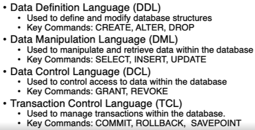{width="281"}

There is both ANSI SQL which is the standard and DMBS Specific 'dialects'

constraints are optional and [] are not actually used

 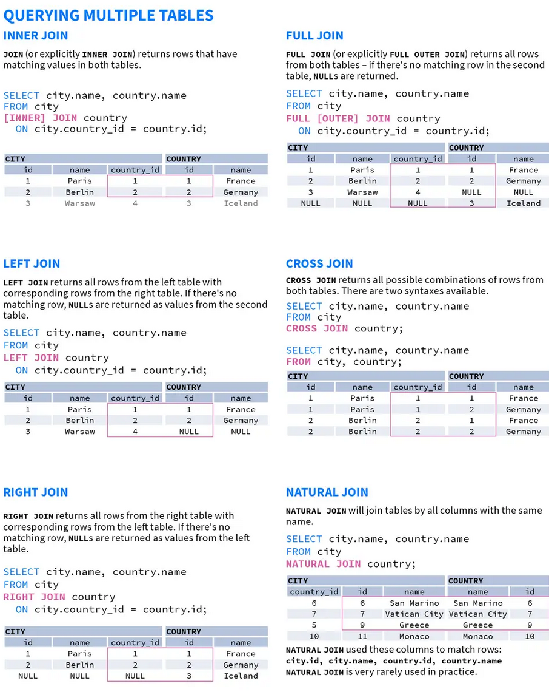   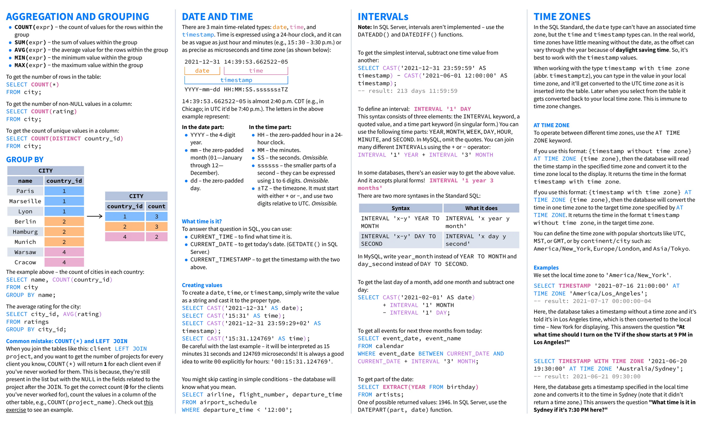

### SQLite {.tabset}

### MySQL Specific

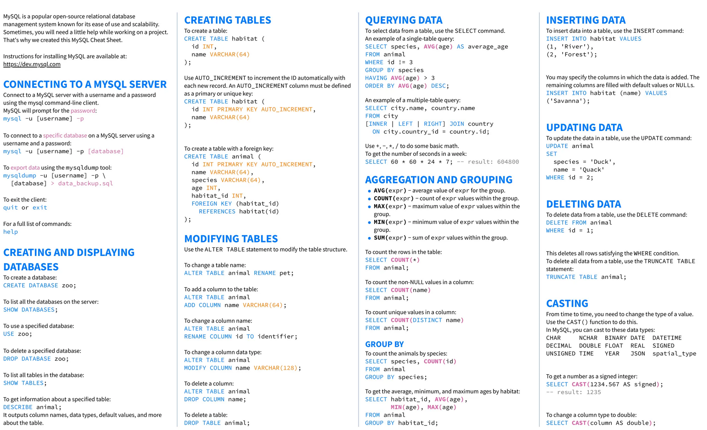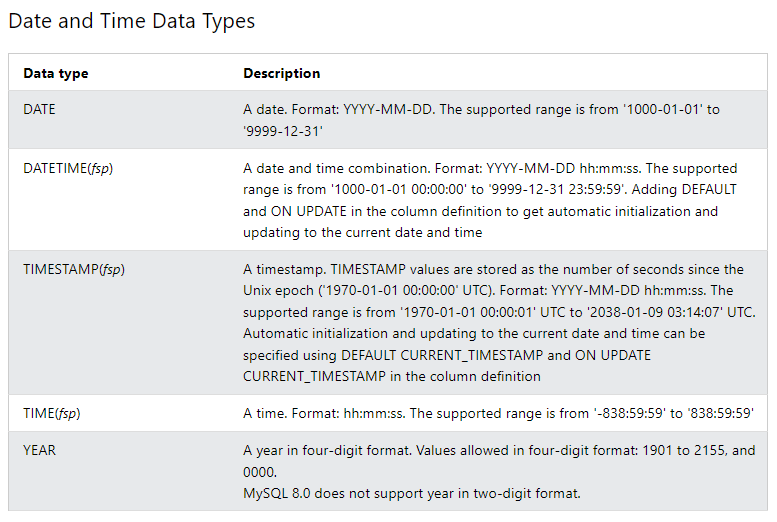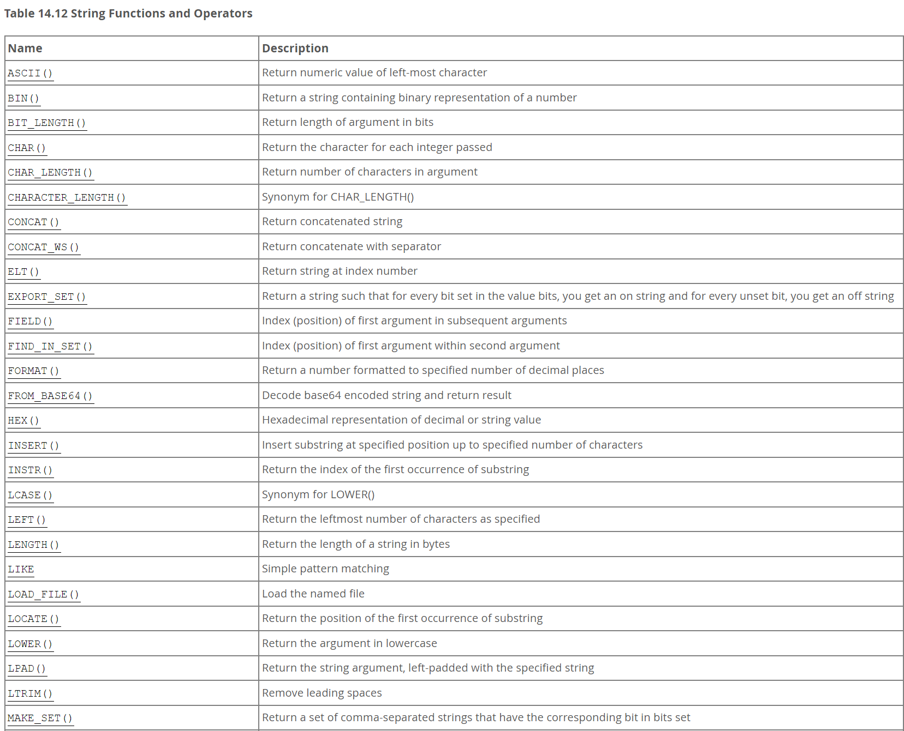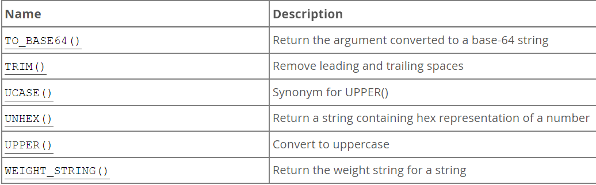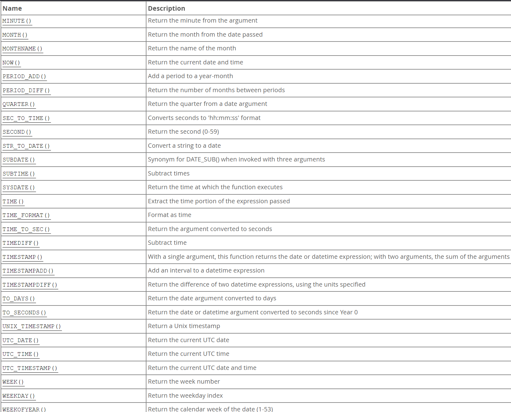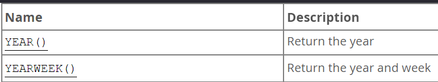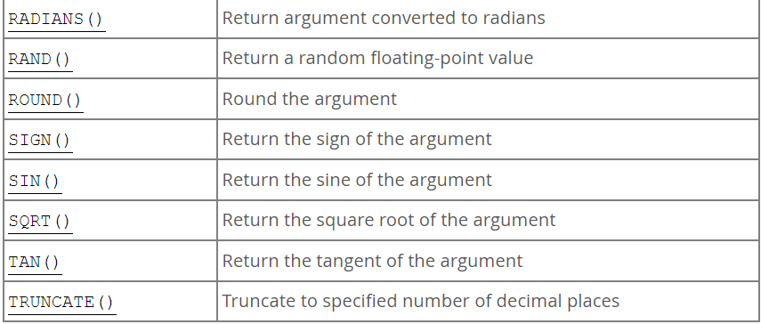

## ***Hernandez Notes*** {.tabset}

### Ch. 1

#### operational vs. analytical, & relational databases

**Operational** primarily used in online transaction processing (OLTP) key feature ability to collect modify data on daily basis stores

-   dynamic data and up to the minute info
-   transactional every day use, data change frequently

**Analytical** primarily used in online analytical processing (OLAP) key feature tracking trends, data over time, and ability to make predictions

-   stores static data (often pull from operational for data source)
-   another term is data warehouse, use for analysis not transactions, shows history over time, data does not change frequently, data often from operational database

a *relationship* is formed in the **relational model** implicitly through matching values of a shared field

**SQL** to create, maintain and query databases

-   You recieve data in a regional database by using *Structured Query Language* (SQL)
-   three components of basic SQL Query are the `SELECT ... FROM` statement, the `WHERE` clause, & the `ORDER BY` clause
-   `SELECT` indicates the fields selected, `FROM` is the table(s) within which the fields belong
-   the `WHERE` clause allows for filtering by criteria
-   the `ORDER BY` clause is for sorting in ascending or descending order
-   Queries can be saved
-   a simple scripting language that can be used to create, add, modify, and query relational databases
-   rough standard but kinda different dialects

RDMS or "Relational Database Management System"

-   software application program to create maintain modify and manipulate a relational database

-   A **relational database** stores data in relations, which the user perceives as tables. Each relation is composed of tuples, or records, and attributes, or fields. - The physical order of the records or fields is immaterial, each record in the table is identified by a field that contains a unique value

    -   Built-in multilevel integrity (basically the issue checker)
    -   logical and physical data independence from database applications (changes don't auto break dependent things unlike excel refs)
    -   guaranteed data consistency and accuracy
    -   easy data retrieval
    -   reduces non-strategic repetition of data (same info multiple sheets, multiple locations of info)
    -   tables are connected to one another through strategic repetition called "keys" (matching info boxes)

#### Primary Keys & 1:1, 1:M, & N:M Relationships

a **one-to-one** relationship is when a single record in one table is related to zero or one record in the other table and vice-versa

a **One-to-many** relationship is where one record in one table is related to any number of records in the other table but the second table records only relate to one record in the first

> you *ALWAYS* copy the primary key from the "1" side to the "many" side

without a table diagram (ERD) (*entity-relationship diagram*) use logic, ie. when a single record in the 1st table can be related to one or more records in the second table but a single record in the second table ONLY relates to one record in the first table

a **many-to-many** relationship is when a record in one table can be related to any number of records in the other table and vice-versa the relationship is established via a linking table (the two primary keys together form a composite primary key, but separately are foreign keys)

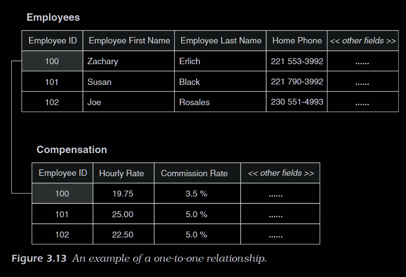{width="330"}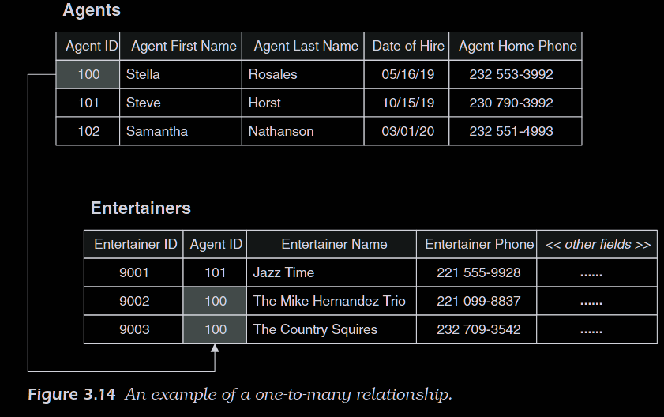{width="337"}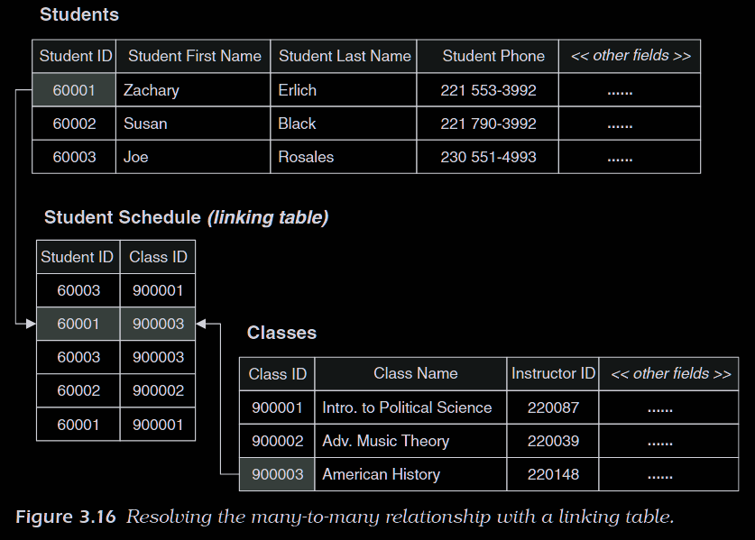{width="322"}

### Ch. 2 {.tabset}

#### Elements of a Database

logical database describes the size shape and necessary systems for the database, then the physical database can be built

The relational database is based on two branches of mathematics known as **set theory** and **first-order predicate logic**.

the problems that good design avoids: redundant data, duplicate data, invalid data, absence of required data

-   The database supports both required and ad hoc information retrieval. (expected and unconventional usage)
-   The tables are constructed properly and efficiently. (single subject, unique values, )
-   Data integrity is imposed at the field, table, and relationship levels. (helps ensure validity)
-   The database supports business rules relevant to the organization.
-   The database lends itself to future growth.

##### Benefits of good design

-   The database structure is easy to modify and maintain. (modifications do not have spill effects)
-   The data is easy to modify. (few duplicates as well)
-   Information is easy to retrieve. (properly established relationships between tables.)
-   End-user applications are easy to develop and build.
    -   data integrity

#### Database Design Steps/Phases

1.  **Requirement analysis** - examination of the business being modeled, needs, and requirements
2.  **Data modeling** using a method such as 'entity-relationship (ER) diagramming, semantic-object modeling, object-role modeling, or UML modeling.' as means of visually representing different aspects of the database structure such as tables, table relationships, and relationship characteristics
    i.  each method incorporates a set of diagramming symbols to represent a databases structure and characteristics
    ii. fields are also defined and associated with the appropriate tables during the data-modeling phase.
    iii. each table is assigned a **primary key** various levels of data integrity are identified and implemented a relationships are established via **foreign** **keys**
3.  **Normalization** is the process of decomposing large tables into smaller ones in order to eliminate redundant and duplicate data and avoid problems with inserting, updating, or deleting data. during the process table structures are tested against normal forms (a specified set of rules to test for a particular set of problems)
    1.  *(The normal forms currently in use are First Normal Form, Second Normal Form, Third Normal Form, Fourth Normal Form, Fifth Normal Form, Sixth Normal Form, Boyce-Codd Normal Form, and Domain/Key Normal Form.)*

### Ch. 3 {.tabset}

#### null

`null` is a missing value **NOT** a zero or or blank spaces, usually `null` in representing an unknown

> `null` breaks math, so if math is needed from a column need to set nulls off

#### tables (data table, validation table)

because of the primary key, data in a relational database can exist independently of the way it is physically stored

-   a **data table** is used to store data and is more changing
-   a **validation table** is more static and is mostly used for reference - field (multipart, multivalued, calculated) - poorly designed fields will contain either **multipart** (2 or more distinct items w/i a field), **multivalued** (multiple instance of same type of value), or **calculated** field (results of either string combination or mathamatical expression)

#### record

unique instance of subject of table, composed of entire set of fields in a table regardless of whether the field contains values

#### view

a view is a 'virtual' table composed of fields from one or more tables in the database (known as **base tables**) (not an actual unique table, just a virtual compilation table)

they can allow multi-table working, the prevention of viewing/editing of specific table fields, and implement data integrity - key (primary, composite, foreign) - \#### primary keys a **primary key** is a field or group of fields that uniquely identifies each record w/i a table (if composed of 2 or more it is a composite primary key) - A primary key *value* identifies a specific record, a primary key *field* identifies a given table - a primary key from one table incorporated into a different table is a **foreign key**

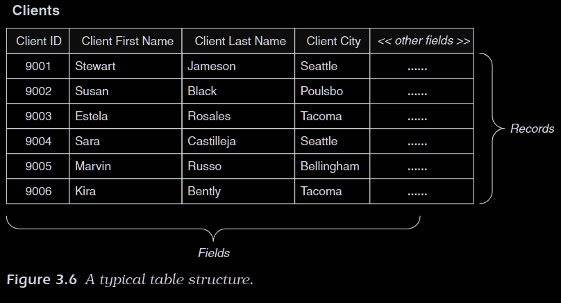{width="386"}

### Ch. 4

1.  define objective for database
2.  analyze existing database
3.  create data structure (tables usually)
4.  establish table relationships
5.  determine and define business rules
6.  determining and defining views
7.  review for integrity
    1.  proper table design/structure
    2.  field specifications/integrity
    3.  validity of relationships
    4.  business rules

### Ch. 7 {.tabset}

Important to make sure that duplicated subject names do not in fact represent different subjects - ex. an `equipment` subject means both equipment needed by the workers (screwdrivers, etc.), and equipment needed by the site (computers, etc.)

also important to make sure different subject titles do not cover same subject despite different names - ex. `clients` and `customers` includes the same data just different names

A *table type* allows you to classify a table by the role it plays within the database and provides you with a means of identifying tables that function in a similar manner. The table’s role determines its type, and you can associate four table types with a given table:

1.  A **data** table represents a subject that is important to the organization and is the primary foundation of the information that the database provides.
2.  A **linking** table establishes a link between two tables in a many-to-many relationship.
3.  A **subset** table contains fields that are related to a particular data table and further describes the data table’s subject in a very specific manner.
4.  A **validation** table contains relatively static data and is a crucial component of data integrity.

a *table description* provides a clear definition of the subject represented by the table and states why the subject is important to the organization (*there are guidelines that govern how to create these*)

Make sure to resolve multivalued and multipart fields

**Redundant** data is a value that is repeated in a field as a result of the field’s participation in relating two tables or as a result of some field or table anomaly. In the first instance, the redundant data is appropriate; by definition, a field used to relate one table to another will contain redundant data. Redundant data is entirely unacceptable in the second instance, however, because it poses problems with data consistency and data integrity; therefore, you should always strive to keep redundant data to an absolute minimum.

A duplicate field is a field that appears in two or more tables for any of these reasons.

-   It is used to relate a set of tables together. (the only necessary case)
-   It indicates multiple occurrences of a particular type of value.
-   There is a perceived need for supplemental information.

remove reference fields (duplicate fields that serve to provide reference info (not the duplicate fields that link tables to eachother) ex. I have my job titles both in a table of each job schedule and in a general job table, the tables are linked by my name, so job titles are unnecessary in both and should be removed from one)

a **subset table** represents a subordinate subject of a particular data table - it contains fieuld that are specific to the subset subject but also that relate it up to the data table (but NOT fields that are common to both as those are unnecessary duplicates

#### To resolve multivalued fields

1.  Remove the field from the table and use it as the basis for a new table. If necessary, rename the field in accordance with the field name guidelines.
2.  Use a field (or set of fields) from the original table to relate the original table to the new table; try to select fields that represent the subject of the table as closely as possible. The field(s) you choose will appear in both tables.
3.  Assign an appropriate name, type, and description to the new table and add it to the Final Table List.

#### To refine previously unidentified subset tables

1.  Remove all the fields that the subset tables have in common and use them as the basis for a new data table.
2.  Identify what subject the new data table represents, and then give that table an appropriate name.
3.  Make sure that the subset tables represent subordinate subjects of the data table and modify the subset table names as necessary.
4.  Compose a suitable description for the data table and then add it to the Final Table List. Indicate the table type as “Data.”

#### Guidelines to creating table names

-   Create a unique, descriptive name that is meaningful to the entire organization.
-   Create a name that accurately, clearly, and unambiguously identifies the subject of the table.
-   Use the minimum number of words necessary to convey the subject of the table.
-   Do not use words that convey physical characteristics. (ie. file, record, table, etc.)
-   Do not use acronyms and abbreviations.
-   Do not use proper names or other words that will unduly restrict the data that can be entered into the table. (ie. location or other specification)
-   Do not use a name that implicitly or explicitly identifies more than one subject.
-   Do use the plural form of the name. (pluralize table names, singularize field names)

#### Guidelines to creating table descriptions

-   Include a statement that accurately defines the table.
-   Include a statement that explains why this table is important to the organization.
-   Compose a description that is clear and succinct.
-   Do not include implementation-specific information in your table description, such as how or where the table is used.
-   Do not make the table description for one table dependent upon the table description of another table.
-   Do not use examples in a table description.

#### Guidelines to creating field names

-   Create a unique, descriptive name that is meaningful to the entire organization.
-   Create a name that accurately, clearly, and unambiguously identifies the characteristic a field represents. (use prefixes where necessary)
-   Use the minimum number of words necessary to convey the meaning of the characteristic the field represents.
-   Do not use acronyms and use abbreviations judiciously.
-   Do not use words that could confuse the meaning of the field name.
-   Do not use names that implicitly or explicitly identify more than one characteristic.
-   Use the singular form of the name.

#### Elements of the Ideal Field

-   It represents a distinct characteristic of the subject of the table.
-   It contains only a single value.
-   It cannot be deconstructed into smaller components.
-   It does not contain a calculated or concatenated value.
-   It is unique within the entire database structure.
-   It retains a majority of its properties when it appears in more than one table.

#### Elements of the Ideal Table

-   It represents a single subject, which can be an object or event.
-   It has a primary key.
-   It does not contain multipart or multivalued fields.
-   It does not contain calculated fields.
-   It does not contain unnecessary duplicate fields. (does not apply to fields used to relate tables together)
-   It contains only an absolute minimum amount of redundant data.

### Ch. 8 {.tabset}

**Keys** are crucial because they ensure that each record in a table is precisely identified, they help establish and enforce various types of integrity, and they serve to establish table relationships.

first type of key established is the **candidate** key, a field(s) that uniquely identifies a single instance of the table's subject, all tables must have at least one

If needed an *Artificial Candidate Key* can be created

A **Primary Key** exclusively identified the table throughout the database structure, and must conform to the same elements as a candidate key (and is typically just selected from the pool of candidate keys, single field if possible and including the table name if possible)

no two tables should have the same primary key, unless they bear a one-to-one relationship or one is a subset table

all non-primary candidate keys become alternate keys

#### Elements of a Candidate Key

-   It cannot be a multipart field.
-   It must contain unique values.
-   It cannot contain Nulls.
-   Its value cannot cause a breach of the organization’s security or privacy rules.
-   Its value is not optional in whole or in part.
-   It comprises a minimum number of fields necessary to define uniqueness.
-   Its values must uniquely and exclusively identify each record in the table.
-   Its value must exclusively identify the value of each field within a given record.
-   Its value can be modified only in rare or extreme cases.

#### Elelments of a Primary Key

-   It cannot be a multipart field.
-   It must contain unique values.
-   It cannot contain Nulls.\
-   Its value cannot cause a breach of the organization’s security or privacy rules.
-   Its value is not optional in whole or in part.\
-   It comprises a minimum number of fields necessary to define uniqueness.\
-   Its values must uniquely and exclusively identify each record in the table.\
-   Its value must exclusively identify the value of each field within a given record.
-   Its value can be modified only in rare or extreme cases.

### Ch. 9 {.tabset}

#### Field Specifications

**Field Specifications** are crucial because

-   Field specifications help establish and enforce field-level integrity.
-   Defining field specifications for each field enhances overall data integrity.
-   Defining field specifications compels you to acquire a complete understanding of the nature and purpose of the data in the database.
-   Field specifications constitute the “data dictionary” of the database.

a field reaches **Field-level integrity** if

> -   The identity and purpose of a field are clear, and all the tables in which it appears are properly identified.
> -   Field definitions are consistent throughout the database.
> -   The values of a field are consistent and valid.
> -   The types of modifications that can be applied to the values in the field are clearly identified.

#### Anatomy of a Field Specification {.tabset}

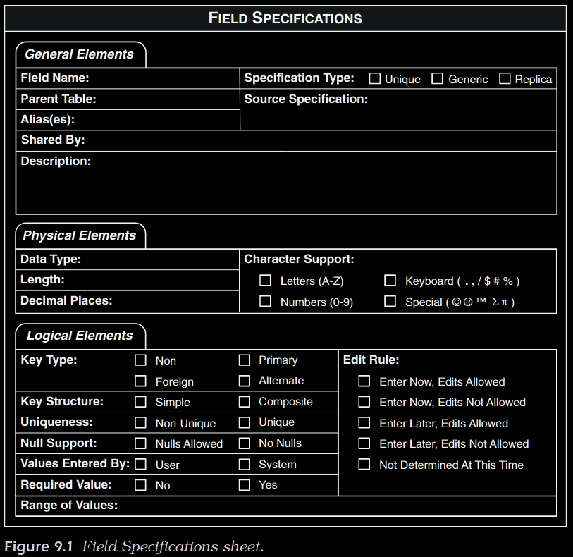

##### General Elements

Field Name, Parent Table, Specification Type, Source Specification, Shared By, Alias(es), Description

*The most fundamental attributes of the field*

The **Field Name** is the set of *absolutely minimal* words that uniquely identifies a particular fields throughtout the database

A table that incorporates a given field within its structure is known as the fields **parent table** this is the *only* table w/i which the field will appear *unless* the field is participating in establishing a relationship.

the elements set for a given field depend n the type of **specification** defined for the field. it can be defined in three ways

1.  **Unique** the default unless a template or foreign key, can receive all but `Source Specification` element and elements only apply to specified field from the `Field Name` element
2.  **Generic** template field to help ensure consistent definitions for fields with the same *general* meaning,(ex. for different state fields, even if they have different subjects they all contain a US State) requires a nonspecific field name and element settings that are as broad and general as possible but can take all elements but `Parent Table`, `Shared By`, `Alias(es)`, and `Source Specification`
3.  **Replica** this is the default for a field based on a generic field or that serves as a foreign key, it draws the majority of its element settings from an existing specification but elements can be altered or added

the `Source Specification` element is set only on a **Replica** specification and indicates the name of the specific field specification upon which the current specification is based.

the `Shared By` element indicates the names of other tables that share this field, the **only** table names that showuld appear hear are those that have an explicit relationship to the fields parent table

the `Alias(es)` element is a name or set of names that you use for the field in *very rare* circumstances for instance where there *must* be two instances of the field in the *same* table

the `description` element is a complete interpretation of the field

##### Physical Elements

Data Type, Length, Decimal Places, Character Support

The physical elements category pertains to the structure of a field its elements are expressed in general terms because each RDBMS program implements them in a slightly different manner.

the **Data Type** elelment indicates the nature of data that the field stores there are 3 main types (more exist and are used but they tend to be more program specific)

1.  **Alphanumeric** - any combo including keyboard and special characters
2.  **Numeric** - only whole and real numbers, not including numbers with leading 0s (ex. 0022)
3.  **DateTime** - dates times or combo of both

the **Length** element specifies the total number of characters that a user can enter for any given field value (some programs do not allow setting of this value)

the **Decimal places** element denotes the number of digits to the right of the decimal point in a real number.

the **character support** element indicates the types if characters that a user can enter into a given field value - can include or exclude any of the following types of characters

-   *Letters*: All letters of the alphabet including foreign language letters such as é and ñ.
-   *Numbers*: 0 through 9.
-   *Keyboard characters*: Any standard character other than letters and numbers, such as asterisk, ampersand, bracket, caret, comma, equals sign, exclamation point, parenthesis, percent sign, period, pound sign, question mark, quote, semicolon, slash, or vertical bar.
-   *Special characters*: Any character that you can produce only through specific combinations of standard keys and the CTRL, ALT, and/or SHIFT keys, or with the aid of a special software program. Characters in this category include complex mathematical symbols, the copyright symbol, fractions, the symbol for pi, and the trademark symbol.

##### Logical Elements

Key Type, Key Structure, Uniqueness, Null Support, Values Entered By, Required Value, Range of Values, Edit Rule

the **Logical Elements** categor pertains mainly to the values within a field, governing matters such as role w/i table, uniqueness, when in should be entered, can it be edited...

the **Key type** element designates a fields role w/i a table (non-key, primary key, alternate key, foreign key)

the **Key structure** element denotes whether a field designates as a primary key is acting as a simple (single-field) or part of a composite (multifield) primary key

the **Uniqueness** element indicates whether a fields values are `unique` (typically just for primary key) or `non-unique`

the **Null support** element specifies whether a field excepts nulls or not

the **Values entered by** element indicates the source of the fields values (needs to be set up before works)

the **Required value** element denotes whether a user is required to enter a value for a field (must be `yes` for the primary key)

the **Range of values** element specifies every possible valid value for this field, this range can be established under three general categories. (DO NOT use "other" or "miscellaneous" w/i ANY category)

1.  *General* - A complete collection of every possible value for this field.
2.  *Integrity-specific* - A collection of values based on the field’s role within a table relationship.
3.  *Business-specific* - A collection of values generated by a particular business requirement.

the **Edit rule** element designates at what point a user can enter a value into a field and whether they can modify that value has 5 options

1.  *Enter Now, Edits Allowed* - must enter value when creating a new record, value can be edited at any time
2.  *Enter Later, Edits Allowed* - can enter when creating a new record, must at some point, value can then be edited at any time
3.  *Enter Now, Edits Not Allowed* - must enter value when creating new record, cannot be edited
4.  *Enter Later, Edits Not Allowed* - can enter when creating a new record, must at some point, value cannot be edited
5.  *Not Determined At This Time* - the edit rule will be determined when the database is implemented in an RDBMS program

#### Guidelines for Composing a Field Description

-   Use a statement that accurately identifies the field and clearly states its purpose.
-   Write a clear and succinct statement.
-   Refrain from restating or rephrasing the field name.
-   Avoid using technical jargon, acronyms, or abbreviations.
-   Do not include implementation-specific information.
-   Do not make this description dependent upon the description of another field.
-   Do not use examples.

### Ch. 10 {.tabset}

#### Relationships

$1:1$ = one-to-one

> OR parent to child relationship, parent PK = child FK

$1:N$ = one-to-many $M:N$ = many-to-many

there are 2 main types of question to ask to determine the table relationships -

**Associative** - can a single record be associated with one or more records either in a second table or for a self-referencing relationship within the original table.

**Contextual** - contrasts a single instance of the subject of the 1st table with multiple of the 2nd table

it contains two sub-categories

*ownership oriented* - uses words such as "own", "has", "is part of", & "contain"

*action oriented* - uses action verbs such as "make", "visit", "teach", & "attend"

#### Resolving a Multivalued Field

1.  Remove the field from the table and use it as the basis for a new table. If necessary, rename the field in accordance with the field naming guidelines that you learned earlier in this chapter.\
2.  Use a field (or set of fields) from the original table to relate the original table to the new table; try to select fields that represent the subject of the table as closely as possible. The field(s) you choose will appear in both tables.\
3.  Assign an appropriate name, type, and description to the new table and add it to the final table list.

#### Many-to-Many relationships (fixing)

There are two types of bridge/linking table that can be formed to fix a many to many relationship

there is also a thing called **"Flip and Hug"** that basically for a as yet unknown reason when you have a many-to-many relationship when making a linking table the relationships that the 'many' tables have to each other mirror across the bridge.

> ex. if it was $$table1 (1,N) >|-0< (0,N) table2$$ then with the link it would be $$table1 (1,1) ||-0< (0,N) bridge (1,N) >|-|| (1,1) table2$$

##### Composite linking table

A composite linking table has the two PK from the original tables become both the composite PK and the FK for the linking table

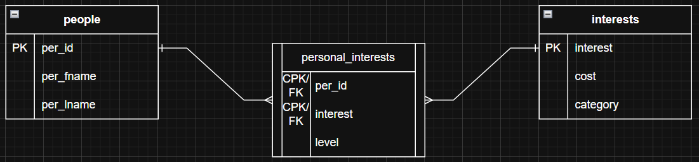

##### Synthetic linking table

a synthetic linking table has the two PK from the original tables only become FK and assigns a synthetic PK to the linking table

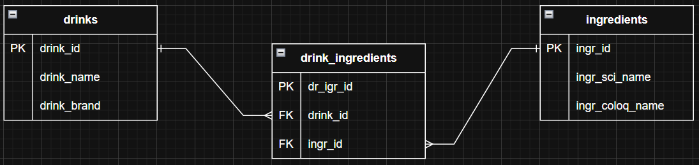

#### Self-Referencing (Recursive) Relationships

self-referencing relationships while not existing between tables (it is between records w/i a table) is generally still regarded as a table relationship - a self-referencing relationship can be 1:1, 1:N, or M:N

##### $1:1$

an example of a 1:1 self-referencing relationship would be a mentor:mentee relationship w/i an employees table where each mentor only has one mentee and vice-versa but they are w/i the same table

##### $1:N$

an example of a 1:N self-referencing relationship would be a 'referred by' situation, where one person could only be referred by a single person, but one person could refer multiple people

##### $M:N$

an example of a M:N self-referencing relationship would be parts, each part can be a component of another part with a unique part number and in turn have component parts to it

#### Elements of a Foreign Key

-   It has the same name as the primary key from which it was copied.

-   It uses a replica of the field specifications for the primary key from which it was copied.

    > ***Defined by***
    >
    > -   Specification Type: "replica" since is replica of PK field specs
    > -   Parent Table:
    > -   Source Specification: indicate parent PK & table name
    > -   Description: purpose within child table as FK

-   It has adjusted logical elements

    > ***Defined by***
    >
    > -   Key Type: "Foreign"
    > -   Uniqueness: "non-unique" **unless 1:1 relationship** as 'non-unique' allows for multiple relationships vs. 'unique' only allows for 1.
    > -   Values Entered By: "User"
    > -   Range of Values: must be restricted to only values contained w/i original PK
    > -   Edit Rule: likely "Enter Now, Edits Allowed" although some situations might require "Enter Later..."

-   It draws its values from the primary key to which it refers.

#### Deletion Rules

it is very important to establish a deletion rule as for what the RDBMS should do when requested to delete a record in the parent table to prevent orphaned records. There are 5 main types.

##### DENY

wont delete but instead classify record as "inactive"

##### RESTRICT

wont delete a record in parent if exist in child, have to delete ALL child records first

##### CASCADE

will delete record in parent and ALL related records in child

##### NULLIFY

will delete record in parent and set FK field in child to NULL (FK field has to be set to allow nulls)

##### SET DEFAULT

will delete in parent update FK to a specified default value YOU set in the RDBMS

#### Participation Type

the type of participation assigned a given table determines whether a record must exist in the table BEFORE you can enter any records into the related table. There are two main types

##### MANDATORY

"At least one record must exist in this table before you can enter any records into the related table."

##### OPTIONAL

"There is no requirement for any records to exist in this table before you can enter records into the related table."

#### Degree of Participation

the degree of participation is the MINIMUM number of records that a given table MUST HAVE associated with a single record in the related table and the MAXIMUM number a given table CAN HAVE associated with a single record in the related table (uses 2 numbers off set by commas w/i parentheses (min,max))

also applies to self-referring relationships

use **N** for infinite assiciations

#### Verify Relationship Checklist

1.  Make sure that you’ve properly identified each relationship.
2.  Make certain that you’ve properly established each relationship.
3.  Make certain that each foreign key complies with the Elements of a Foreign Key.
4.  Make sure that you’ve established an appropriate deletion rule for each relationship.
5.  Make certain that you’ve identified the proper type of participation for each table within a dual-table relationship and for the appropriate key fields in a self-referencing relationship.
6.  Make certain that you’ve identified the proper degree of participation for each table within a dual-table relationship and

#### **Relationship-Level Integrity**

-   The connection between the two tables (or key fields) in a relationship is sound.
-   You can insert new records into each table in a meaningful manner.
-   You can delete an existing record without producing any adverse effects.
-   A meaningful limit exists for the number of records that can be interrelated within the relationship.

#### [DIAGRAMS]{.underline}

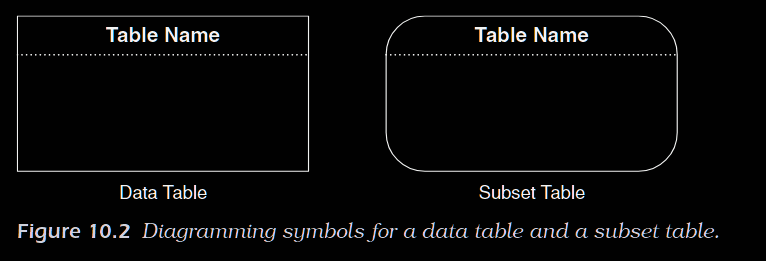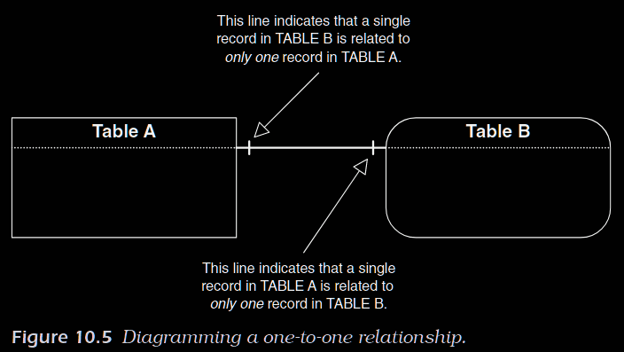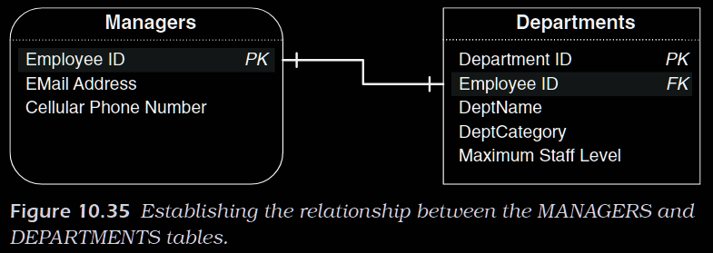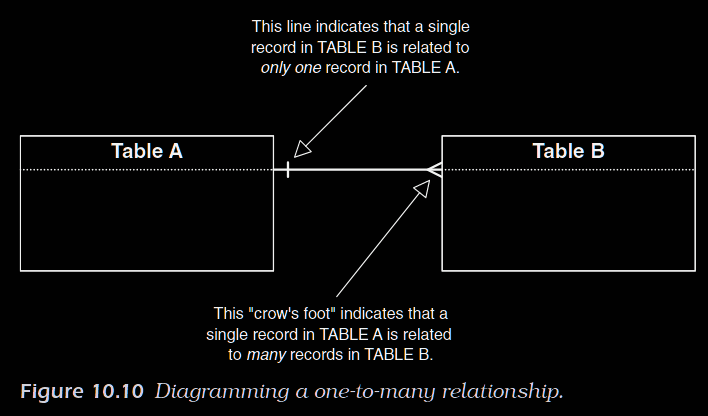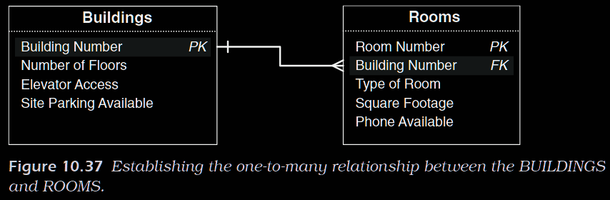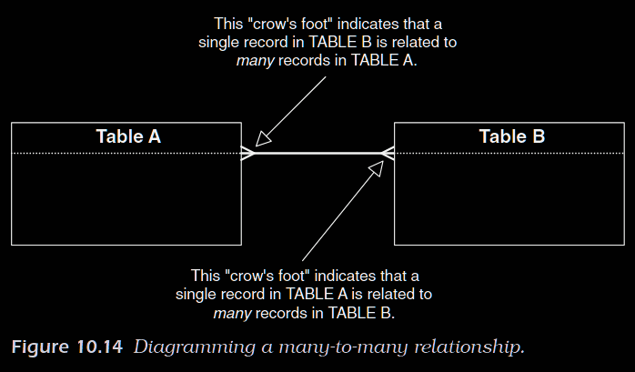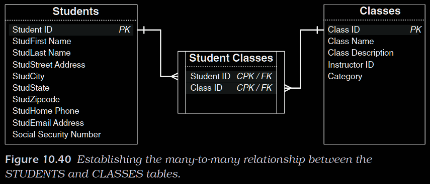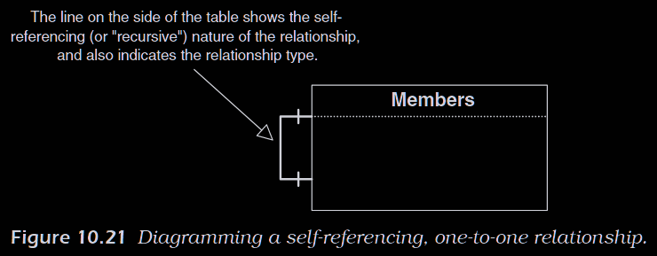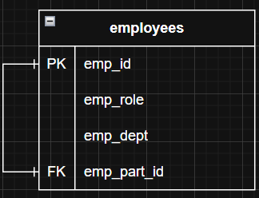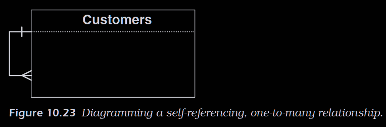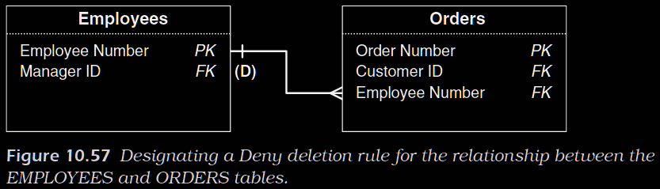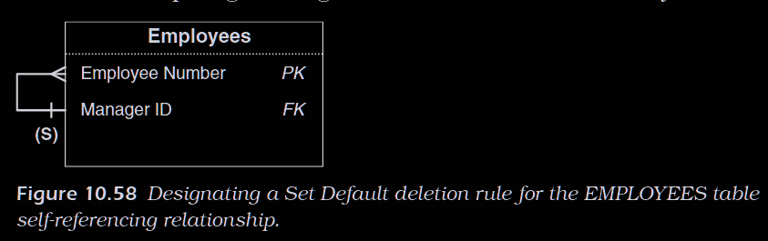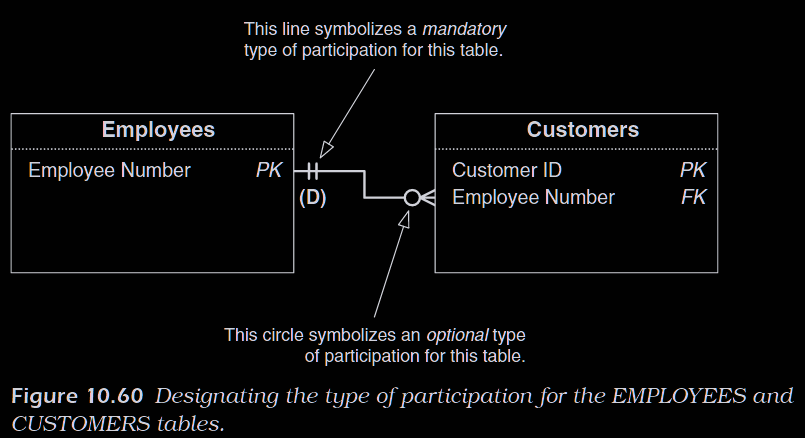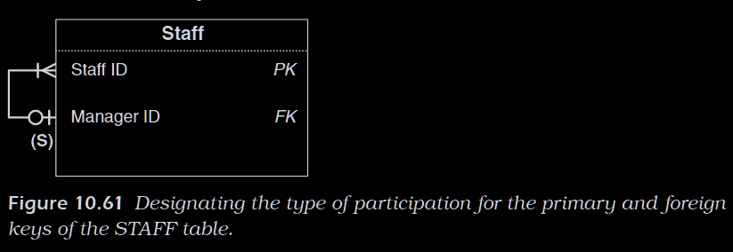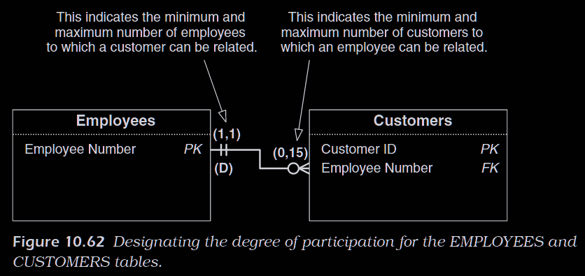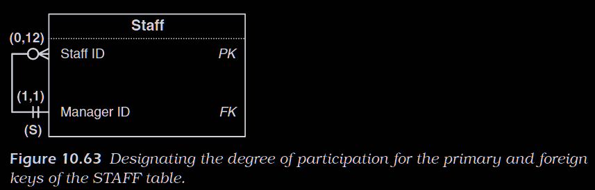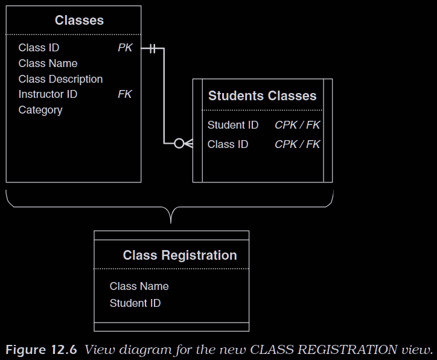

### Ch. 11 {.tabset}

A **business rule** is a statement that imposes some form of constraint on a specific aspect of the database, such as the elements within a field specification for a particular field or the characteristics of a given relationship ex.

> a *ship date* cannot be before an *order date* while this is technically possible within the DB adding this constraint allows the *ship date* to be an actually meaningful date vs. nonsense

You base a business rule on the way the organization perceives and uses its data, which you determine from the manner in which the organization functions or conducts its business.

Business rules often apply to the **Degree of Participation** between tables, which is often not able to be established as an in-database logical constraint

#### Types of business rules

-   The two major types of business rules are **Database Oriented** and **Application Oriented**. Both enforce constraints and data integrity, but differ in where and how they are established.

##### Database Oriented Business Rules

impose constraints you can establish w/i the logical design of the database by modifying field spec. elements and/or relationship char.

MUST be able to meaningfully and clearly establish constraint by either means

> ex. noodles only exist in midwest allow only midwest states in range of values

##### Application Oriented Business Rules

impose constraints that you cannot establish w/i logical design of DB must instead be established w/i physical design or the database software application design

> ex. members earn 15% discount, This business rule determines the amount of discount applied to a customer’s purchases, based on a particular status. You cannot establish this constraint meaningfully in the logical design for two reasons: There is no field in which to store the discount amount (the amount is a result of a calculation, and calculated fields are not allowed in a table), and there is no way to indicate the criterion used-the customer’s status-to determine the discount. You must establish this rule within the physical design of the database or the design of the database application.

#### Categories of business rules

##### Field-Specific Business rule

impose constraints on the elements of a field specification for a particular field. The number of elements a given rule affects depends on the manner in which you define that rule.

##### Relationship-Specific Business Rules

impose constraints that affect the characteristics of a relationship.

#### Defining and Establishing Field-Specific Business rules

1.  Select a table.
2.  Review each field and determine whether it requires any constraints.
3.  Define the necessary business rules for the field.
4.  Establish the rules by modifying the appropriate field specification elements.
5.  Determine what actions test the rule.
6.  Record the rule on a Business Rule Specifications sheet

#### Defining and Establishing relationship-Specific Business rules

1.  Select a relationship.
2.  Review the relationship and determine whether it requires any constraints.
3.  Define the necessary business rules for the relationship.
4.  Establish the rule by modifying the appropriate relationship characteristics.
5.  Determine what actions will test the rule.
6.  Record the rule on a Business Rule Specifications sheet.

#### Validation Tables

Typically used to limit field values

stores data used to implement data integrity, not often edited and usually comprised of only 2 fields

1.  the first acts as the primary key and is what is used to enforce data integrity,
2.  the second is a non-key field that stores a set of values required by some other field in the DB

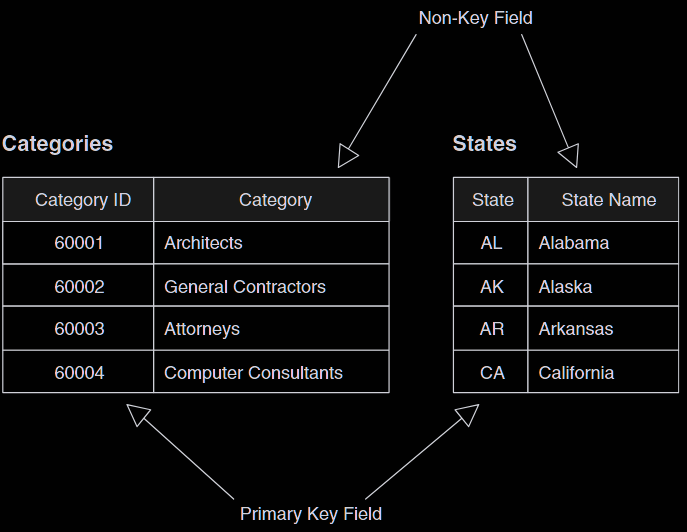

### Ch. 12 {.tabset}

Views are virtual tables comprised of fields from one or more tables in the database or from other views

Views can be used to work with data from multiple tables simultaneously, and has more customization.

also has other diagram

#### View Definitions

##### **View Imposition/Filtering**

you can impose criteria against one or more fields in the view to filter the records it displays, keep in mind for things which have multiple iterations in different context specification likely needed, (ie. multiple cities with the same name in different states) but know the field with the criteria imposed upon it MUST be included in the view or else it doesnt work.

##### Single-Table Data View

data can be modified at any time, pulls from only one table and repopulates data every time it is accessed due to how views work.

##### Multi-Table View

you can define a view using more than one table, but the tables have to have a relationship. you can only edit some of the data.

Redundancy in views is ok because data is not stored

##### Aggregate View

you can define an aggregate view using one or more base tables and one or more calculated fields

All the fields in an aggregate views are considered *grouping fields* so cannot be modified.

##### Validation View

most commonly just one table and a few fields

#### View Specification Sheet

-   **NAME**: The guidelines for naming tables apply to views as well, with the exception that the name of a view can implicitly or explicitly identify more than one subject.

-   **TYPE**: data, aggregate, or validation views

-   **BASE TABLES**: the views base table names

-   **CALCULATED FIELD EXPRESSION**: name of calculated field in standard of field name w/ 2 exceptions you can implicitly or explicitly identify more than one characteristic in a name, and you can use the plural form of the name (but generally don't).

-   **FILTERS**: criteria views will use, both field and expression

## ***Forta Notes*** {.tabset}

### Lesson 1

The information that describes a table is called **Schema**

**Datatype** is the type of data that is able to be stored in columns (there are ways to restrict to specific datatypes)

Records and rows are often used as interchangeable terms

the **Primary Key** is the column or columns that uniquely identify the rows in a table (should always be defined though not always strictly necessary) - no two rows can have the same primary key value, all rows must have a primary key value that should never be modified or updated or reused even if row deleted (if multiple columns are used the individuality rule applies to the combined value of the columns)

**""** are used to delineate a string they are NOT used for numbers

### Lesson 2 showing data {.tabset}

#### `SELECT`

is used to visualize data from a database as a result table

``` sqlmysql
SELECT column1, column2, ...
FROM table_name;

# or if you want to return the whole table
SELECT * FROM table_name

/* or if you want to select only
the distinct values of the column
DISTINCT is placed in front of it
(if used on multiple columns it
only works on the combined column
not the individual columns)*/
SELECT column1, DISTINCT column2, ...
FROM table_name
```

#### `DESC`

or `DESCRIBE` is used to show the structure of a table

``` sqlmysql
DESC table_name;
```

| Field | Type        | NULL | Key | Default | Extra |
|-------|-------------|------|-----|---------|-------|
| col_1 | CHAR(5)     | NO   | PRI | NULL    |       |
| col_2 | INT         | YES  |     | NULL    |       |
| col_3 | VARCHAR(25) | NO   |     | NULL    |       |

#### See table constraints/FK

There are two main ways to see the foreign keys in your table one is

`SHOW CREATE TABLE table_name` which returns the syntax as if you were setting up your table.

the other is to do is use the `information_schema` database and select a table that has the relevant columns

``` sqlmysql
USE INFORMATION_SCHEMA;
SELECT table_name,
       constraint_name,
       referenced_table_name,
       delete_rule,
FROM referential_constraints
WHERE constraint_schema = "<your_database_name>" 
      AND table_name = "<your_table_name>";
```

``` sqlmysql
USE INFORMATION_SCHEMA;
SELECT TABLE_NAME,
       COLUMN_NAME,
       CONSTRAINT_NAME,
       REFERENCED_TABLE_NAME,
       REFERENCED_COLUMN_NAME
FROM KEY_COLUMN_USAGE
WHERE TABLE_SCHEMA = "<your_database_name>" 
      AND TABLE_NAME = "<your_table_name>" 
      AND REFERENCED_COLUMN_NAME IS NOT NULL;
```

which returns as example

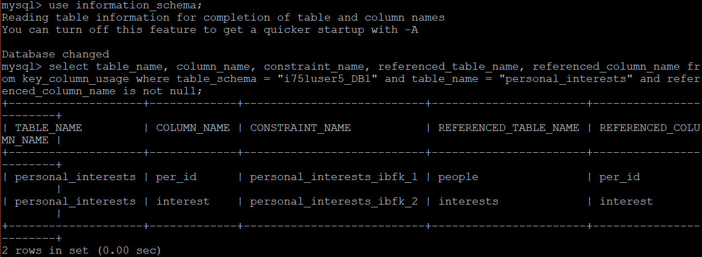

for copying DO NOT FORGET TO CHANGE THE DB NAME AND TABLE NAME

``` sqlmysql
use information_schema; select table_name, column_name, constraint_name, referenced_table_name, referenced_column_name from key_column_usage where table_schema = "mydatabasename" and table_name = "mytablename" and referenced_column_name is not null;
```

#### Aliasing (`AS`)

Aliasing is used to get a different name for either a single column or when combining columns, most commonly used to shorten names

**IF YOU WANT TO GET A COLUMN NAME FOR ANY SUMMARY FUNCTIONS YOU MUST USE `AS()` FUNCTION**

can specify distinct on all functions as well to get only the distinct values (can only be used on specified SINGLE columns

**These go around the column name in the `SELECT` function**

`AS` can also be omitted IF the alias directly follows the name it is aliasing. ex. `SELECT col1 AS 1col` could also be `SELECT col1 1col` which would render the same thing and it works for `CONCAT` as well

### Lesson 3 (`ORDER BY` & `LIMIT`)

`ORDER BY` is used by listing column name that the data from a select will be sorted by **NEEDS TO BE LAST IN SELECT STATEMENT**,

> column used to sort does not necessarily need to be one being displayed

``` sqlmysql
SELECT * FROM table1
ORDER BY column1 --orders in ascending order

# this can be used on multiple columns
SELECT * FROM table1
ORDER BY column1, column2 -- orders first by column1 then by column2
```

you can also sort by column position using numbers.

`LIMIT` is used to specify the number of records to return

``` sqlmysql
SELECT * FROM table1 LIMIT 3; --returns 1st 3 records  SELECT * FROM table1 LIMIT 3 OFFSET 3; -- returns records 4 thru 6  # this can also follow the syntax SELECT * FROM table1 LIMIT 3,3; -- which returns the same as the previous query
```

### Lesson 4 (`WHERE`)

`WHERE` is used to select only rows where the specified column is the specified value.

> `WHERE` can also be used in other operations

`ORDER BY` MUST come after `WHERE` else there are errors

``` sqlmysql
SELECT * FROM table1
WHERE column1 = 1;

#using the between operator requires AND between the options
SELECT * FROM table1
WHERE column1 BETWEEN 1 AND 5;
```

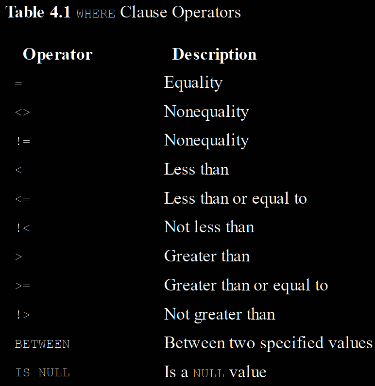{width="315"}

### Lesson 5 (`AND`/`OR`/`IN`/`NOT`)

You can combine `where` clauses by using any combination of `and` + `or` clauses, using parentheses to maintain groups and specific orders is important

``` sqlmysql
SELECT * FROM table1
WHERE column1 = 1 AND column2 !=1 ;
#returns all records that fulfill both conditions

SELECT * FROM table1
WHERE column1 = 1 OR column 1 != 1;
#returns all records that fulfill either condition

SELECT * FROM table1
WHERE NOT column1 = "text";
#returns all records where column1 is NOT "text"

SELECT * FROM table1
WHERE column1 IN ("text","text2","text3");
/*essentially multiple OR statements in one 
(can also use the NOT condition)*/

SELECT * FROM table1
WHERE column1 IN (SELECT columnA FROM table2);
#returns all records where column1 is in columna of table2
```

### Lesson 6 (`LIKE`)

`like` is a wildcard operator that allows for a comparison as a wildcard match vs. a straight equality match

the most frequently used wildcard is `%` which w/i a search string means *match any number of occurrences of any character* ex. "fish%" = "fish","fishes","fish food",... or "%food%" = "fish food", "food bag", "dog food bag",... or "b%g" = "bag", "bog",... (DOES NOT work for `NULL` values)

the `_` wildcard matches an SINGLE character in that spot

> a note - some DBMS pad field contents with spaces, and a search will not work because there are extraneous spaces at the end that do not have a wildcard marker

### Lesson 7 (`CONCAT`) & (`TRIM`)

In SQL `select` statements you can concatenate (join values together) using either `+` or `||` dependant on DBMS for MySQL must use `Concat`

``` sqlmysql
SELECT CONCAT (value1, value2, etc)
FROM table_id
ORDER BY value1;
#which returns the response in 1 column w/o a name
value1_1 value2_1
value1_2 value2_2
#to get a name use `as`
SELECT CONCAT (value1, value2)
  AS col_id
FROM table_id
ORDER BY value1;
#which equals
col_id
-------------------
value1_1 value2_1
value1_2 value2_2
```

it is HIGHLY recommended to alias columns with multiword names to single word names (these are sometimes called "Derived columns")

> for `+` or `||` remove `CONCAT()` and place the symbol in replacement of the commas `,`

you can also calculate using columns in the expected manner

``` sqlmysql
SELECT num_id,         num1*num2 AS num_sum FROM table_id  
#which would return the two columns  
num_id      num_sum
----------     ----------- 
num_id1   num_sum1 
num_id2   num_sum2 
```

**to trim unneeded spaces you can use the function `rtrim()`, `ltrim()`, or `trim()` which respectively trim the right, left, and both sides of the string**

### Lesson 8 functions {.tabset}

functions tend to be very DMBS specific

`SUBSTRING()` will extract parts of a string, `CONVERT()` will allow you to change your datatype, `CURDATE()` will allow you to get the current date

there are a few main types of functions

#### Text functions

- which are used to manipulate strings of text (for example, trimming or padding values and converting values to upper- and lowercase).

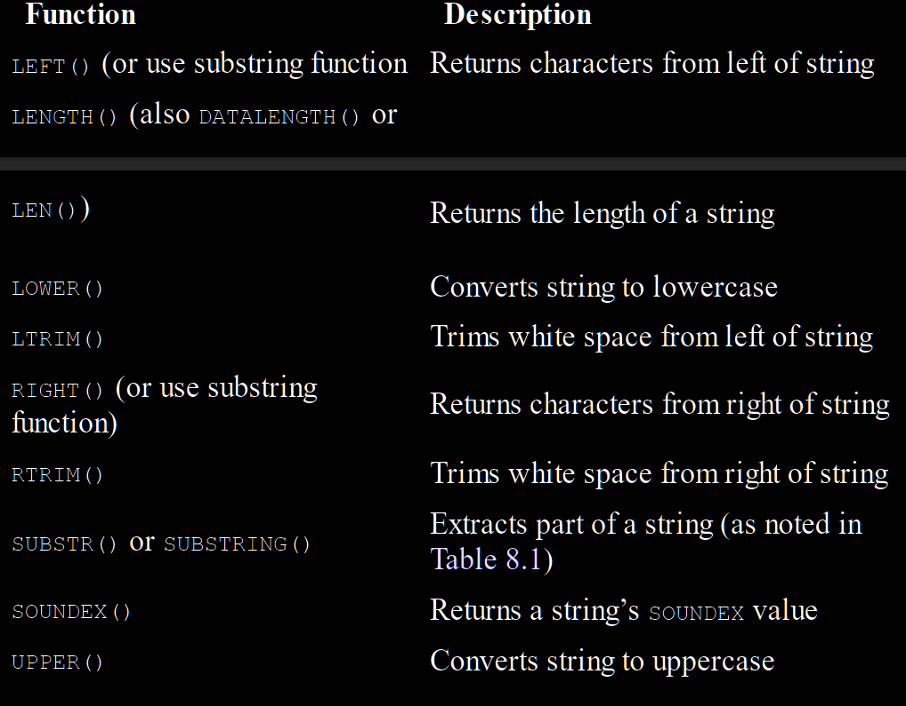

`SOUNDEX` is an algorithm that converts any string of text into an alphanumeric pattern describing the phonetic representation of that text allowing strings to be compared by how they sound instead of how they have been typed

ex. `SOUNDEX('Michael Green')` would return "*Michelle Green*" as a result

#### Numeric functions

- which are used to perform mathematical operations on numeric data (for example, returning absolute numbers and performing algebraic calculations).

#### Date and time functions

- which are used to manipulate date and time values and to extract specific components from these values (for example, returning differences between dates and checking date validity).

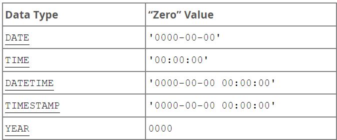

#### Formatting functions

- which are used to generate user-friendly outputs (for example, displaying dates in local languages and formats, or currencies with the right symbols and comma placement).

#### System functions

- which return information specific to the DBMS being used (for example, returning user login information).

### Lesson 9 summarizing

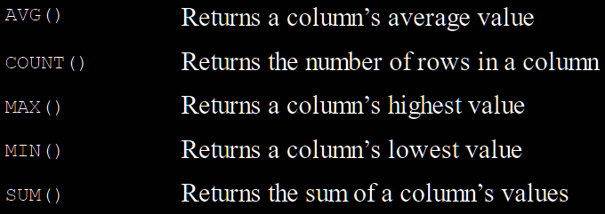

#### `AVG`

average value of all or specified col/rows - can use any filtering - **If you want to average multiple columns separately you HAVE to do multiple `AVG()` functions doing only one will average all columns together** - NULL values are ignored by `AVG()`

#### `COUNT`

is used 2 ways, `COUNT(*)` to get num rows in table, or `COUNT(column)` to gen num rows NOT NULL in column

#### `MAX`&`MIN`

`MAX()` returns highest value in **specified** column - *some DBMS allow it to return the row that would be last if data sorted by that column for textual data*

`MIN()` returns lowest value in **specified** column (ignoring NULL) - *some DBMS allow it to return the row that would be 1st if data sorted by that column for textual data*

#### `SUM`

total of the values in specified column(s) (ignoring NULL) - *can be used on column calculations*

### Lesson 10 grouping

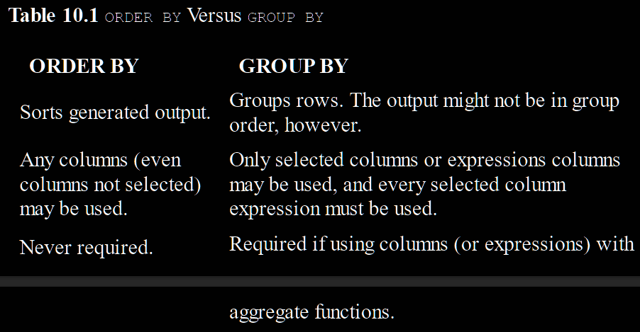

`GROUP BY` groups the data in the response by the specified column(s)

``` sqlmysql
SELECT column_name(s)
FROM table_name
WHERE condition
GROUP BY column_name(s)
ORDER BY column_name(s); 
```

You also want to use `ORDER BY` when grouping to get a coherent sorting

> -   `GROUP BY()` clauses can contain as many columns as you want. This enables you to nest groups, providing you with more granular control over how data is grouped.
> -   If you have nested groups in your `GROUP BY` clause, data is summarized at the last specified group. In other words, all the columns specified are evaluated together when grouping is established (so you won’t get data back for each individual column level).
> -   Every column listed in `GROUP BY` must be a retrieved column or a valid expression (but not an aggregate function). If an expression is used in the `SELECT`, that same expression must be specified in `GROUP BY`. Aliases cannot be used.
> -   Most SQL implementations do not allow `GROUP BY` columns with variable length datatypes (such as text or memo fields).
> -   Aside from the aggregate calculation statements, every column in your `SELECT` statement must be present in the `GROUP BY` clause.
> -   If the grouping column contains a row with a NULL value, NULL will be returned as a group. If there are multiple rows with NULL values, they’ll all be grouped together.
> -   The `GROUP BY` clause must come after any `WHERE` clause and before any `ORDER BY` clause. although `WHERE` only looks at specific rows having no concept of groups

`HAVING` is what is needed in order to filter the grouping itself and all options for `WHERE` can be used for `HAVING` ex.

``` sqlmysql
SELECT column1 AVG(*) AS col_num
FROM table_id
GROUP BY column1
HAVING COUNT(*) > 2;
/* which returns the number of rows in
column1 that have more than 2 rows 
WHERE wouldn't work in this situation
because you want the filtering w/i the
grouping not before or after*/
```

you can use `WHERE` and `HAVING` in the same statement

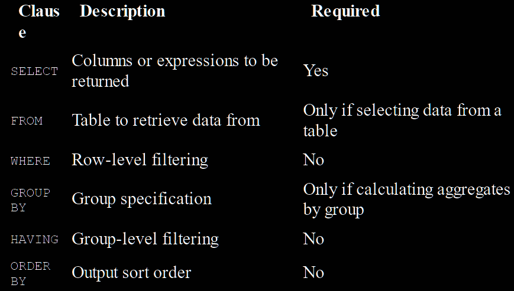

### Lesson 11 subqueries

you can run `SELECT` statements w/i each other in order to extra filter (a subquerie) they process the innermost statement and work outward

subqueries can ONLY retrieve single columns

### Lesson 12 (`INNER JOIN`)

#### Inner Joins

**only** keeps rows that appear in both

``` sqlmysql
#to Inner Join Tables
SELECT col1, col2, col3
FROM table1
INNER JOIN table2 
ON table1.idkey = table2.idkey;
#(=) is equijoin just use (<>) for not

/*you can INNER JOIN multiple tables
just use multiple INNER JOIN commands*/
```

#### Natural Joins

Natural joins are inner joins that only return unique data (most common)

``` sqlmysql
SELECT col1, col2
FROM table1
NATURAL JOIN table2;
/* this returns the same thing as 
an INNER JOIN with an ON clause*/
```

### Lesson 13 "Outer Joins"

#### Self Joins

Self joins can be used as an alternate to subqueries

``` sqlmysql
SELECT col1, col2
FROM table1 AS t1, table1 AS t2
WHERE condition;
```

#### Left Join

returns all records from the table on the left (t1) and the matching ones from the right (t2) or none if they don't exist (can also be called `LEFT OUTER JOIN`)

``` sqlmysql
SELECT col1, col2
FROM table1
LEFT JOIN table2
ON table1.colname = table2.colname;
```

#### Right Join

returns all records from the table on the right (t2) and the matching ones from the left (t1) or none if they don't exist (can also be called `RIGHT OUTER JOIN`)

``` sqlmysql
SELECT col1, col2 
FROM table1 
RIGHT JOIN table2 
ON table1.colname = table2.colname;
```

#### Cross Join (Full Join)

return all records from both tables (adding a `where` makes it essentially an inner join)

``` sqlmysql
SELECT col1, col2
FROM table1
CROSS JOIN table2;
```

### Lesson 14 (`UNION`)

multiple `SELECT` statements are typically called "unions" or "compound queries"

and can be linked by the `UNION` function (it is most useful with complex queries or from multiple tables)

``` sqlmysql
SELECT col1, col2, col3
FROM table1
WHERE col1 > 1
UNION
SELECT col1, col2, col3
FROM table1
WHERE col2 = 'name';
/*this would return one table
that combined both statements*/
```

------------------------------------------------------------------------

$$
Rules
$$

-   `UNION` must be composed of two or more `SELECT` statements, each separated by the keyword `UNION` and the columns MUST be in the same order
-   Each query in a `UNION` must contain the same columns, expressions, or aggregate functions (and some DBMSs even require that columns be listed in the same order)
-   Column datatypes must be compatible. They need not be the same name or the exact same type, but they must be of a type that the DBMS can implicitly convert (for example, different numeric types or different date types)
    -   if the name is different it will take the first one
-   `UNION` removed duplicated to return all use `UNION ALL` which a `WHERE` clause cannot do

### Lesson 15 (`INSERT`)

`Insert` is used to add rows, (complete, partial, or query results) you can just specify the table then list your values

``` sqlmysql
INSERT INTO table_name
VALUES ('value1', num1, 'value3', NULL, etc...);
```

HOWEVER it is safer and better practice to define the row order `table name(row, names, in order, needed);` and then the `values` in the same order specified, and a value must exist for each specified column. you can also include multiple rows by putting them in parentheses separated by a comma

``` sqlmysql
INSERT INTO table_name (column1, column2) 
VALUES ('value1', 'value2'), ('value1', 'value2')
#which would add two rows to column 1 and 2
```

you can omit columns to insert partial row, - BUT that only works if the columns not used have a default value or allow `NULL` (which covers for not putting values)

`insert` can be used with `select` in one command (`insert select`) which works in the same way as regular insert however it uses `select` instead of `values`

This adds ALL the rows from the specified columns in the other table to the matching positioned column in the first table (**name matching is irrelevant, it is position/order specific**)

to copy data from a existing table into a new table use `select into` command (where, group by, and multiple table joins may all be used, but it will only create one table)

``` sqlmysql
SELECT * INTO new_table 
FROM existing_table
```

### Lesson 16 (`UPDATE`&`DELETE`)

`UPDATE` and `DELETE` modify the data in a table in one of two ways - either updating specific rows or all

**MUST use `WHERE` to call the specific row wanted OR it WILL affect all rows**

(*there is a possible* `FROM` *clause to update from another table, that is DBMS specific.)*

``` sqlmysql
UPDATE table_name
SET column2 = 'what want to add'
WHERE column1 = identifier;
#to update multiple columns
UPDATE table_name
SET column3 = 'what want to add', 
    column2 = '2nd col add info'
WHERE column1 = identifier,
#to delete column value (sets to NULL)
UPDATE table_name
SET column2 = NULL
WHERE column1 = identifier,

#to delete row (wont work with FK)
DELETE FROM table_name
WHERE column_name = identifier;
/*won't delete table itself 
(also to delete all rows faster)*/
TRUNCATE TABLE table_name;
```

### Lesson 17 (`CREATE/ALTER/DROP TABLE`)

``` sqlmysql
CREATE TABLE table_name(
    column_1  date(yyyy-mm-dd)  NULL,
    column_2  char("size")  NOT NULL,
    column_3  decimal("# of digits","precision")  NULL,
    column_4  varchar("max size")  NOT NULL,
    column_5  int  NOT NULL
);
```

If `NOT NULL`is not specified the default is `NULL` which allows `NULL`s

*If you need to change a column from `NOT NULL` to `NULL`*

``` sqlmysql
ALTER TABLE tablename 
MODIFY columnname columndatatype NULL;
```

you can specify default values for when no value is entered by putting `DEFAULT` in the fourth column ex. in MySQL to get the date if date is not specified `DEFAULT  CURRENT_DATE`

to update table definitions use `ALTER TABLE` shouldn't change tables after built though, but can add columns, most places cant remove or change columns, but they can be renamed - the best way to add things is to make a new table and then rename the new table, and rename the old one or remove it

``` sqlmysql
ALTER TABLE table_to_be_edited
ADD column_name CHAR (num);
```

to delete a table there is the `DROP TABLE` command that has no confirmation or undo

if the table is a parent table, the child table has to be dropped first

### Lesson 18 (`VIEW`)

views are most commonly used to hide complex SQL

you also cannot `UPDATE` a view you just have to `DROP` and rebuild it or you can do `REPLACE`.

it is generally good practice to not build a view tied to specific data (ex. a customer)

``` sqlmysql
#to create a view 
CREATE VIEW view1 AS
SELECT col1, col2, col3
FROM table1, table2, table3
WHERE table1.idcol = table2.idcol AND table2.idcol = table3.idcol;
/*you can then just query the view
as you would any table*/
```

### Lesson 22 keys and constraints {.tabset}

#### Primary Key Setting

to set the primary key when initially creating a table you include after your list of columns a `primary key` constraint, which can be one or multiple columns

``` sqlmysql
#to set the primary key when one column  CREATE TABLE table_name( 
col_1 int NOT NULL, 
col_2 int, 
col_3 int, 
PRIMARY KEY (col1) );
#OR
CREATE TABLE table_name( 
col_1 int NOT NULL PRIMARY KEY, 
col_2 int, 
col_3 int);
#to set the primary key when multiple columns 
CREATE TABLE table_name( 
col_1 int NOT NULL, 
col_2 int NOT NULL, 
col_3 int, 
CONSTRAINT a_name PRIMARY KEY (col_1,col_2) ); 
/*this sets col_1 & 2 together as the VALUE of the primary key, but under one name*/
```

to set the primary key when altering a table, it just runs as a regular `alter table` command with the synax as above AND the column(s) being set as primary key MUST have been marked `NOT NULL` during creation ex.

``` sqlmysql
ALTER TABLE table_name 
ADD PRIMARY KEY (col_name); 
#or the multiple column syntax above
```

``` sqlmysql
#to drop a primary key constraint 
ALTER TABLE table_name 
DROP PRIMARY KEY;
```

#### Foreign Key Setting

``` sqlmysql
/* to set the foreign key on a new table
if you want the FK to be required set col
to NOT NULL, else if optional leave nullable */
CREATE TABLE table_name( 
col_1 int NOT NULL PRIMARY KEY, 
col_2 int NOT NULL, 
col_id int,
FOREIGN KEY (col_id) REFERENCES 
orig_table(col_id) );

# to add a FK to an existing table
ALTER TABLE table_name
ADD FOREIGN KEY (COL_ID) REFERENCES
parent_table(COL_ID);
/* this does the same thing as when creating
but on an existing table */

/* to effect the foreign key on delete (or
update) action the default is "RESTRICT" 
for what actions see 'CH 10 Deletion Rules' */
FOREIGN KEY (col_id) REFERENCES 
parent_table(col_id) ON DELETE
RESTRICT|CASCADE|SET NULL|SET DEFAULT 
```

This also works for foreign keys in recursive relationships

#### Unique Constraints

unique constraints are used to ensure that all data in column(s) is unique. similar to PK (ex. you would want a unique constraint on a social security number but do not want to use that as the PK)

-   A table can contain multiple unique constraints, but only one primary key is allowed per table.
-   Unique constraint columns can contain NULL values.
-   Unique constraint columns can be modified or updated.
-   Unique constraint column values can be reused.
-   Unlike primary keys, unique constraints cannot be used to define foreign keys.

uses either `UNIQUE` in table definition or a separate `CONSTRAINT`

#### Check constraints

Check constraints are used to ensure that data in column(s) meets a set of criteria

common uses

-   Checking minimum or maximum values: ex. not allowing a value of 0 even though technically valid number
-   Specifying ranges:
-   Allowing only specific values:
